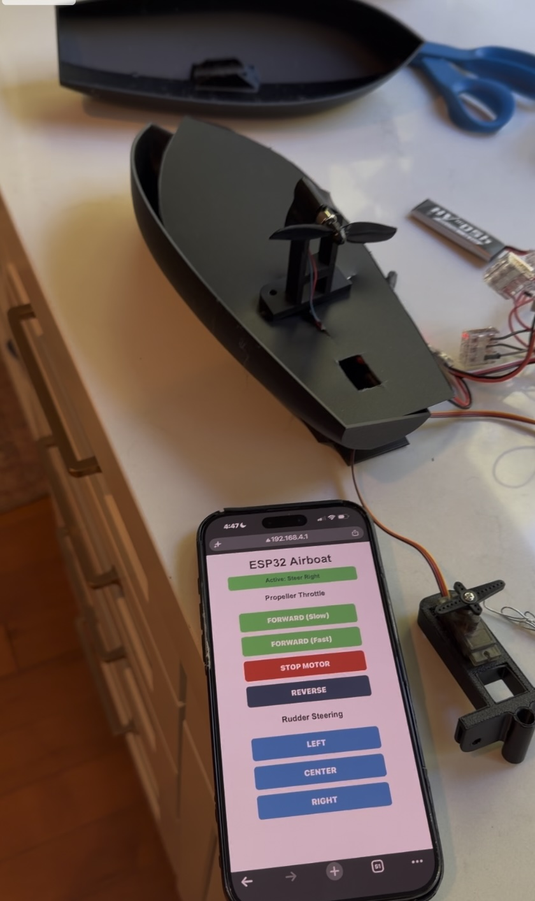

# boat_drone (DRAFT)
This repository supports a learning activity to build a small boat drone. It is organized into a set of learning tasks and can be useful basis for lab or class on the topic. 

  

## Repository goal in more detail
There is an experimental small electronic motor boat outlined on one of the 3D printing model websites ([here](https://cults3d.com/en/3d-model/game/motor-boat-rc-small-experimental). Although that website provided the STL files, very little information was provided on the electronics. In addition, some of the STL files had issues as well. In this repository we provide a series of step-by-step activities to take the basic model and enhance it so that it can be controlled by a standard iOS or Android mobile phone. 

## BOM
TBD

## Tasks
1. [Software Environment setup and getting ESP32 to blink (&#9989;  V1 doc DONE)](./doc/setup.md): this is an initial task to get the PC environment setup to compile and load some simple code to the ESP32.
2. [Controlling the Servo (Rudder) using the EPS32 -- (&#9989; V1 doc DONE)](./doc/basic_servo.md). In this task we learn how to setup and control the servo from the ESP32. This servo will eventually power the rudder of the boat drone.
3. [Controlling the Servo (Rudder) using a mobile phone and ESP32 Ethernet and Webserver -- (&#9989; V1 doc DONE)](./doc/esp32_wifi_and_servo_control.md): We fire up the ESP32's wifi and run a web server to allow us to control the servo from a mobile phone.
4. [Wiring DC motor and battery -- &#9989; V1 doc DONE](./doc/dc_motor_and_battery.md): In this task we hookup the DC motor and the battery to the boat electronics.
5. [Everything working off of the battery](./doc/battery_powered.md): In the previous task only the DC motor was working off of the battery. Now lets get everything working all off of the battery.
6. [Propelling_the_boat -- &#128679; TBD](./doc/propelling_the_boat.md): An interesting challenge from the original boat...how should we propell it?
7. [Powering the rudder and propellor -- &#128679; TBD](./doc/rudder_and_propellor.md): This task is about getting a working rudder and propellor.
8. [Does the boat float? -- &#128679; TBD](./doc/does_the_boat_float.md): With all of the electronics and the other pieces we need to test bouyancy. 
9. [Wifi range testing -- &#128679; TBD](./doc/wifi_range_testing.md): how far can the boat be away from the cell phone? what happens when we go out of that range? can we improve that behavior?
10. [Water-proofing the boat -- &#128679; TBD](./doc/waterproofing_the_boat.md): water and electricity don't mix well. 
11. [Testing on a simulated lake -- &#128679; TBD](./doc/simulated_lake.md): we are now ready to test on a simulated lake.
12. [Testing on a real lake -- &#128679; TBD](./doc/real_lake.md): We are ready to try the boat out on a real lake!

