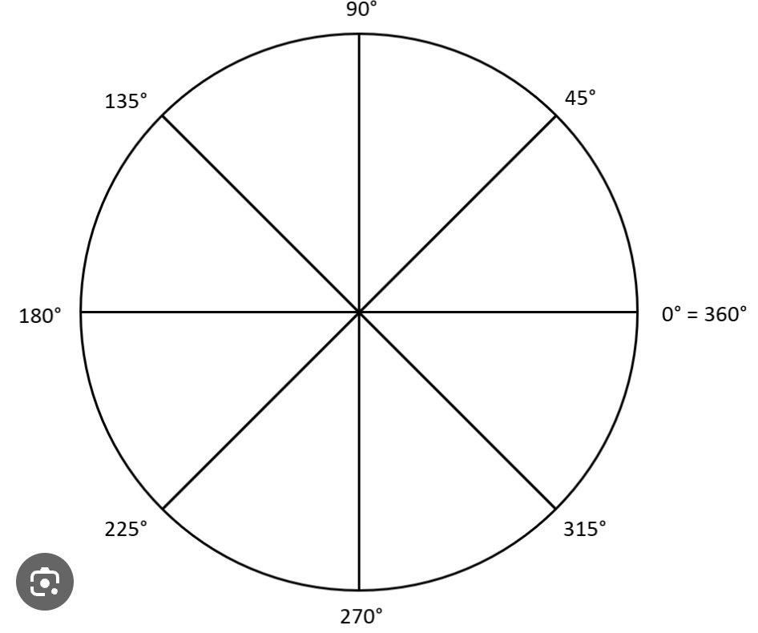
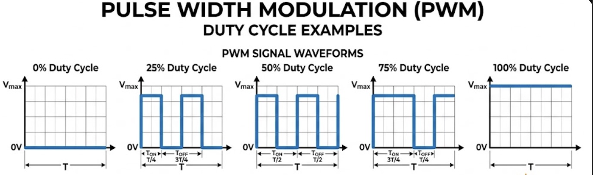
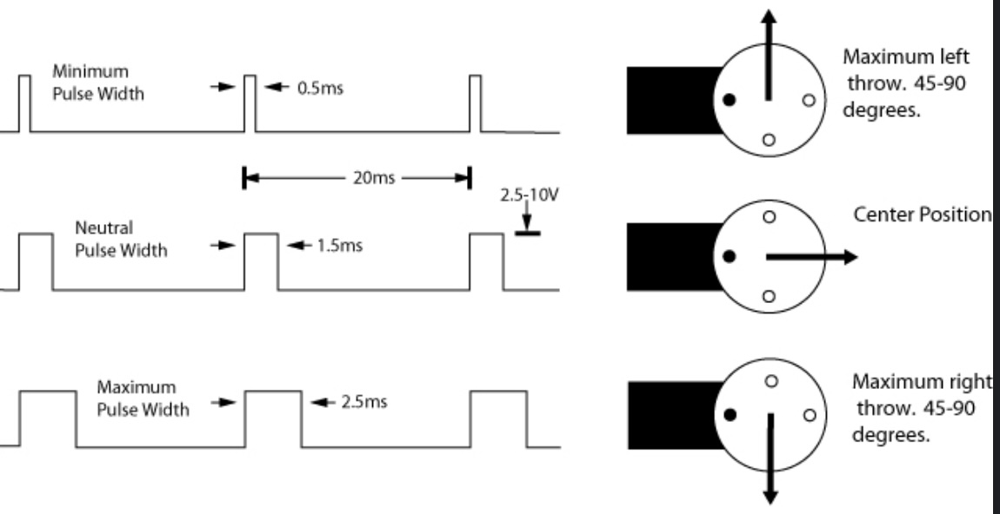
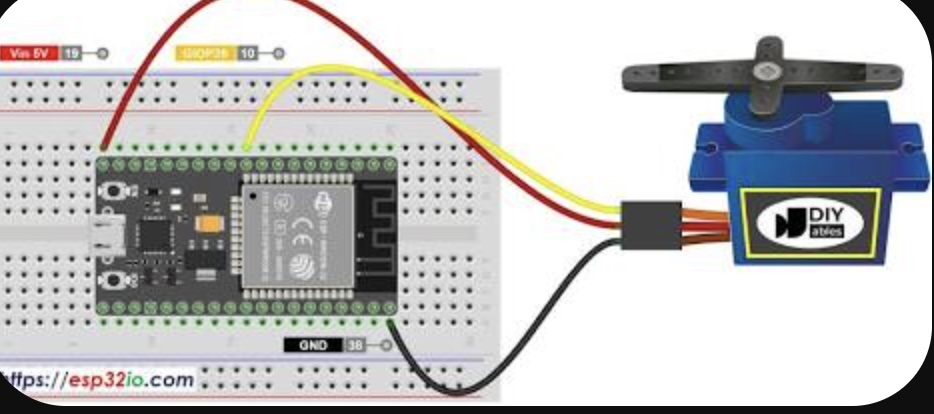
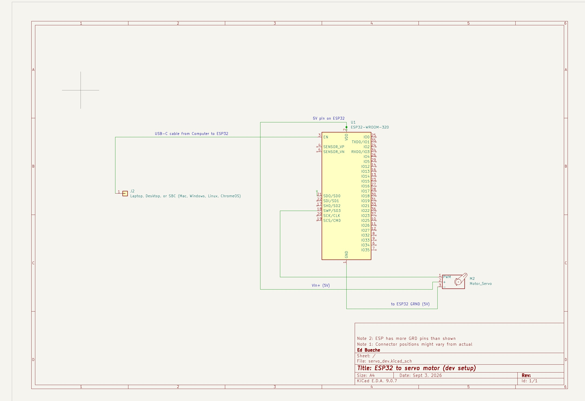

# Basic Servo setup
The servo motor will be used to control the rudder. In this section we will get the basic servo motor working with the ESP32. 

## Background

Before we dive into this section, lets give a little more background to help understand what we are going to accomplish.

### Angles and Degrees on a circle
An angle describes how far something has rotated. We measure angles in degrees (°). One complete trip around a circle is 360°, half a circle is 180°, and one quarter of a circle is 90°. This is illustrated below,

<p align="center">
  
</p>


For our airboat, we don't need the servo to make a complete circle. We use angles to tell the servo where we want the rudder to point—for example, left, center, or right.

### PWM
PWM (Pulse Width Modulation) is a way for a computer such as the ESP32 to control another device using electrical pulses. The signal rapidly switches between ON and OFF (voltage high and voltage low). The width of the pulse is the duration that it is on. This is illustrated below.

<p align="center">
  
</p>

For a servo motor, the important part is the width (duration) of each pulse. A shorter pulse tells the servo to move toward one position, while a longer pulse tells it to move toward another position. A pulse somewhere in between tells it to move somewhere in between.

So conceptually:

ESP32 → changes pulse width → servo changes angle

One useful distinction for students: with a hobby servo, PWM isn't simply controlling how much power goes to the motor. The pulses are commands telling the servo what position to move to. This is illustrated below.

<p align="center">
  
</p>

### Servo Motor
A servo motor is a motor designed to move to and hold a particular angular position. Unlike a normal DC motor that simply spins when power is applied, a servo contains electronics and a position-sensing mechanism that allow it to move to a requested angle.

In our airboat, the ESP32 sends a PWM control signal to the servo. The servo interprets the pulse width as a requested position and rotates the rudder to that position.

A nice connection between all three concepts is:

Degrees describe the position we want → the ESP32 represents that position with a PWM signal → the servo converts that signal into physical rotation.

In this project we are using the MG90S 9g Metal Gear Micro Servo. 

## Hardware
For this exercise you need the following parts:
1. ESP32 and usb cable to the pc
2. Servo motor (e.g., the MG90S 9g Metal Gear Micro Servo)
3. three wires (preferably red, black, and yellow)

Now for this exercise we are assuming you are using the Lonely Binary 3-Pack ESP32 Gold WiFi BT 3 Expansion Bases for Arduino IDE (see amazon: https://www.amazon.com/dp/B0FR3GVRD5). The type of wires will depend on the base extension board used or whether you are using a plain breadboard. 

## Step 1: Wire up the servo

The picture below shows an example setup using a bread board.
<p align="center">
  
</p>

The servo has a three wire female plug with a brown, red, and orange wire.
1. connect your red wire to the ESP32 5V pin and the red servo wire
2. connect your black wire to the ESP32 grnd pin and the brown servo wire
3. connect your yellow wire to the ESP32 pin 18 and the yellow servo wire

Now, the diagram above is a reasonable illustration of this simple circuit. An alternate representation is shown below. We will be building more complicated wiring diagrams based on this representation, so its good to see the differences between the two.

<p align="center">
  
</p>

## Step 2: attach any of the arms to the servo gear
There are three choices that come with the servo.

## Step 3: compile the basic_servo sketch to the ESP32

There is a program in the firmware directory called `basic_servo/basic_servo.ino`. This will step through various servo changes.

the first step is to compile:

```
cd ~/boat_drone/firmware
arduino-cli compile --fqbn esp32:esp32:esp32 ./basic_servo/basic_servo.ino 
```

Example output:

```
$ cd ~/boat_drone/firmware
$ arduino-cli compile --fqbn esp32:esp32:esp32 ./basic_servo/basic_servo.ino 
Sketch uses 284559 bytes (21%) of program storage space. Maximum is 1310720 bytes.
Global variables use 22488 bytes (6%) of dynamic memory, leaving 305192 bytes for local variables. Maximum is 327680 bytes.
```


The second step is to upload. Once this is successful the servo arm will start moving through various positions.

```
cd ~/boat_drone/firmware
arduino-cli upload -p /dev/ttyUSB0 --fqbn esp32:esp32:esp32 ./basic_servo
```

Example output.

```
$ arduino-cli upload -p /dev/ttyUSB0 --fqbn esp32:esp32:esp32 ./basic_servo
esptool v5.3.1
Connected to ESP32 on /dev/ttyUSB0:
Chip type:          ESP32-D0WD-V3 (revision v3.1)
Features:           Wi-Fi, BT, Dual Core + LP Core, 240MHz, Vref calibration in eFuse, Coding Scheme None
Crystal frequency:  40MHz
MAC:                20:e7:c8:ab:2f:50

Stub flasher running.
Changing baud rate to 921600...
Changed.

Configuring flash size...

Writing '/home/bueche/.cache/arduino/sketches/58AE8CACAD0A7C0D053756AB92F9970B/basic_servo.ino.bootloader.bin' at 0x00001000...
Flash will be erased from 0x00001000 to 0x00007fff...
Wrote 24992 bytes (16001 compressed) at 0x00001000 in 0.4 seconds (530.1 kbit/s).
Hash of data verified.

Writing '/home/bueche/.cache/arduino/sketches/58AE8CACAD0A7C0D053756AB92F9970B/basic_servo.ino.partitions.bin' at 0x00008000...
Flash will be erased from 0x00008000 to 0x00008fff...
Wrote 3072 bytes (146 compressed) at 0x00008000 in 0.0 seconds (1029.9 kbit/s).
Hash of data verified.

Writing '/home/bueche/.arduino15/packages/esp32/hardware/esp32/3.3.11/tools/partitions/boot_app0.bin' at 0x0000e000...
Flash will be erased from 0x0000e000 to 0x0000ffff...
Wrote 8192 bytes (47 compressed) at 0x0000e000 in 0.0 seconds (1331.2 kbit/s).
Hash of data verified.

Writing '/home/bueche/.cache/arduino/sketches/58AE8CACAD0A7C0D053756AB92F9970B/basic_servo.ino.bin' at 0x00010000...
Flash will be erased from 0x00010000 to 0x00055fff...
Wrote 284704 bytes (165569 compressed) at 0x00010000 in 2.2 seconds (1012.9 kbit/s).
Hash of data verified.

Hard resetting via RTS pin...
New upload port: /dev/ttyUSB0 (serial)
```

## Step 4: monitor the movement.

```
arduino-cli monitor -p /dev/ttyUSB0 -c baudrate=115200
```

Example output.

```
$ arduino-cli monitor -p /dev/ttyUSB0 -c baudrate=115200
Monitor port settings:
  baudrate=115200
  bits=8
  dtr=on
  parity=none
  rts=on
  stop_bits=1

Connecting to /dev/ttyUSB0. Press CTRL-C to exit.
�����������������Sweep Angle: 180
Sweep Angle: 178
Sweep Angle: 176
Sweep Angle: 174
Sweep Angle: 172
Sweep Angle: 170
Sweep Angle: 168
:
:
:
Sweep Angle: 20
Sweep Angle: 18
Sweep Angle: 16
Sweep Angle: 14
Sweep Angle: 12
Sweep Angle: 10
Sweep Angle: 8
Sweep Angle: 6
Sweep Angle: 4
Sweep Angle: 2
Sweep Angle: 0

[MODE 3] Wiggle Time!
 -> Wiggle Right!
 -> Wiggle Left!
 -> Wiggle Right!
 -> Wiggle Left!
 -> Wiggle Right!
 -> Wiggle Left!
 -> Wiggle Right!
 -> Wiggle Left!
 -> Wiggle Right!
 -> Wiggle Left!

Resetting to center position for 3 seconds...

```

## Understanding the code

we can take a look at the code in more detail now.

```
cd ~/boat_drone/firmware
cat -n basic_servo/basic_servo.ino
```

The example output:
```
$                         
cat -n basic_servo/basic_servo.ino
     1	#include <ESP32Servo.h>
     2	
     3	// Create servo object
     4	Servo myServo;
     5	
     6	// Pin and parameter settings
     7	const int SERVO_PIN = 18;  // Connect orange signal wire to GPIO 18
     8	
     9	void setup() {
    10	  // Start the serial console at 115200 baud
    11	  Serial.begin(115200);
    12	  delay(1000); // Give serial monitor a second to connect
    13	  
    14	  Serial.println("\n--- ESP32 Servo Demo Ready! ---");
    15	
    16	  // Allow allocation of all timers for ESP32 PWM channels
    17	  ESP32PWM::allocateTimer(0);
    18	  ESP32PWM::allocateTimer(1);
    19	  ESP32PWM::allocateTimer(2);
    20	  ESP32PWM::allocateTimer(3);
    21	
    22	  // Standard 50Hz PWM frequency for micro servos
    23	  myServo.setPeriodHertz(50);
    24	  
    25	  // Attach servo with min/max pulse widths in microseconds (standard MG90S defaults)
    26	  myServo.attach(SERVO_PIN, 500, 2400);
    27	
    28	  // Move to initial home position (center)
    29	  Serial.println("[SETUP] Moving to home position (90 degrees)...");
    30	  myServo.write(90);
    31	  delay(1000);
    32	}
    33	
    34	void loop() {
    35	  // --- MODE 1: Precision Positions ---
    36	  Serial.println("\n[MODE 1] Jumping to exact angles...");
    37	  
    38	  Serial.println(" -> Moving to 0 degrees");
    39	  myServo.write(0);
    40	  delay(1200);
    41	
    42	  Serial.println(" -> Moving to 90 degrees (Center)");
    43	  myServo.write(90);
    44	  delay(1200);
    45	
    46	  Serial.println(" -> Moving to 180 degrees");
    47	  myServo.write(180);
    48	  delay(1200);
    49	
    50	  // --- MODE 2: Smooth Scanning Sweep ---
    51	  Serial.println("\n[MODE 2] Smoothly sweeping back and forth...");
    52	  
    53	  // Sweep from 0 to 180 degrees slowly
    54	  for (int angle = 0; angle <= 180; angle += 2) {
    55	    myServo.write(angle);
    56	    Serial.print("Sweep Angle: ");
    57	    Serial.println(angle);
    58	    delay(20); // Small delay creates smooth motion
    59	  }
    60	
    61	  delay(300);
    62	
    63	  // Sweep back from 180 to 0 degrees
    64	  for (int angle = 180; angle >= 0; angle -= 2) {
    65	    myServo.write(angle);
    66	    Serial.print("Sweep Angle: ");
    67	    Serial.println(angle);
    68	    delay(20);
    69	  }
    70	
    71	  // --- MODE 3: Fast Wiggle Dance ---
    72	  Serial.println("\n[MODE 3] Wiggle Time!");
    73	  for (int i = 0; i < 5; i++) {
    74	    Serial.println(" -> Wiggle Right!");
    75	    myServo.write(70);
    76	    delay(150);
    77	    
    78	    Serial.println(" -> Wiggle Left!");
    79	    myServo.write(110);
    80	    delay(150);
    81	  }
    82	
    83	  // Return to center before repeating the entire cycle
    84	  Serial.println("\nResetting to center position for 3 seconds...");
    85	  myServo.write(90);
    86	  delay(3000);
    87	}
```

Lets walk through some of the high points of the code.

### Servo object 
The code starts out by "including" some pre-built code for operating a servo using the ESP32 controller.
```
     1	#include <ESP32Servo.h>
     2	
     3	// Create servo object
     4	Servo myServo;
```

Whenever you see `#include` means that the objects and logic for the library or package (in this case `ESP32Servo`) can now be used in the program. The syntax: `Servo myServo` creates an "object' (which is a software concept which you can think of as data + logic to manipulate the object). In this case the object can be used to send control signals to the servo so that its wheel will move.

### Initializing the servo

TBD

```
    16	  // Allow allocation of all timers for ESP32 PWM channels
    17	  ESP32PWM::allocateTimer(0);
    18	  ESP32PWM::allocateTimer(1);
    19	  ESP32PWM::allocateTimer(2);
    20	  ESP32PWM::allocateTimer(3);
    21	
    22	  // Standard 50Hz PWM frequency for micro servos
    23	  myServo.setPeriodHertz(50);
    24	  
    25	  // Attach servo with min/max pulse widths in microseconds (standard MG90S defaults)
    26	  myServo.attach(SERVO_PIN, 500, 2400);
    27	
```

### Positioning the servo

The servo is positioned with a `myServo.write(angle)` function call, where `angle` is a variable that holds the angle that the servo is being directed to turn to. This code walks through several scenarios: (1) discrete positioning at 0, 90, and 180 degrees, (2) small increments of two degrees, and (4) quick wiggling motion back-and-forth from 70 to 110 degrees.

## Bonus: Extending the code

As a bonus, try extending the code. Again, you will need to compile and upload after each set of code changes.

### Change the delay between each servo.write 
You can either slow or speed up the delays.


