# Getting all of the Electronics working off of the battery

In our previous task we powered the ESP32 and servo using the development PC and powered the DC motor off of the battery. In this task we work to get everything working off of the battery. This turned out to be much more complicated that it would seem at first glance.

The complications we need to solve include the following:
- The battery is 3.8 volts but the ESP32 and servo's need a constant 5V.
- The electrical demands associated with starting and running of the DC motor causes a very sudden drop in voltage in the circuit. This spike can cause the ESP32 to fail.
- When the DC motor stops it sends an "electrical backwash" through the system that can damage other components.

## Definitions
As with the previous sections, we have a few things to define.

### Voltage Booster (DC-DC Step-Up Converter)
A small electronic circuit board that takes a lower incoming voltage and raises ("boosts") it to a higher, stable voltage level. We are using MT3608 Boost Converter. The booster has an input and output side both sides have pos/neg terminals. In addition, it comes with a potentiometer that you adjust to get the desired output voltage.

Think of it like a **water pressure pump**. Even if incoming water pressure from a main tank is weak or dropping, the pump forces water up to a higher, steady pressure line for a upper-floor sink.

While used here for a 1S LiHV battery (3.3V to 4.35V), standard booster boards (like the MT3608) work with almost any low-voltage DC power source between 2V and 24V—including USB power (5V), standard LiPo batteries, or AA batteries.

Steps up the battery's fluctuating 3.3V–4.35V output to a steady +5V power rail required to run the ESP32 microcontroller and the servo motor.

Boosting voltage does not create free energy. To increase pressure (voltage), the pump must pull a higher volume of water (current) from the source. As the battery sags, the booster pulls even more current to maintain that 5V output.

  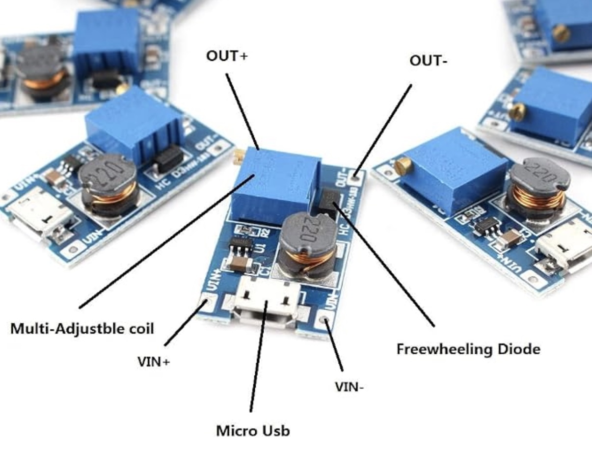

### Diodes
 A one-way valve for electricity. It allows electrical current to flow forward through a wire but blocks it from flowing backward.

Functions exactly like a **one-way check valve** in plumbing. Water can easily push through the valve in one direction, but if pressure drops or a shockwave comes back, the valve instantly snaps shut.

* **Function in Circuit:** 
  1. **Prevents Energy Starvation:** When the motor accelerates, it pulls a massive amount of power. The diode stops the motor from "sucking" stored energy backward out of the ESP32 and servo power lines.
  2. **Blocks Voltage Spikes:** When the motor suddenly stops, its magnetic coils collapse, creating a sudden electrical shockwave (like **water hammer** in a pipe). The diode blocks this negative energy spike from blasting backward out of the motor and frying the sensitive microchips on the computer board.

  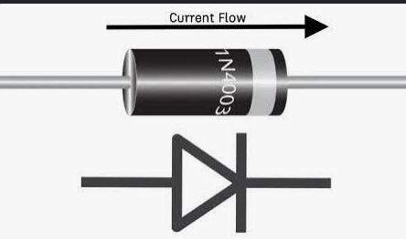

### Capacitors
A tiny, rechargeable electrical reservoir that stores a quick burst of energy and releases it instantaneously when power dips. It has two wires coming out. The larger one should connect to the positive flow of current and the shorter one the negative (or gnd) flow.

Functions like (and looks kinda like) a **water tower or expansion tank**. When main pipe pressure is normal, water fills the tower. When a sudden demand causes pipe pressure to drop briefly, water instantly drains out of the tower to keep the water flowing at the tap without disruption.

* **Function in Circuit:** 
  * **Large Polarized Electrolytic ($470\,\mu\text{F} - 1000\,\mu\text{F}$):** Placed on the 5V servo power line to supply instant power bursts when the servo motor suddenly turns, keeping the main voltage smooth.
  * **Small Non-Polarized Ceramic ($0.1\,\mu\text{F}$):** connected the DC motor pins to absorb tiny electrical sparks and high-frequency noise generated by the spinning motor brushes before that noise can scramble the computer board.

  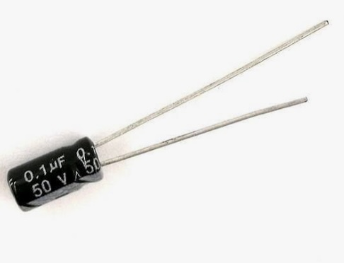
  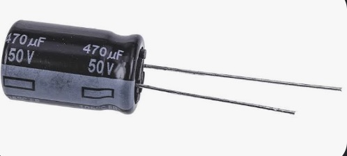

### Switch 
A mechanical lever or slider that physically breaks the wire connection to turn the power completely ON or OFF. Placed on the main positive battery line to serve as a master power switch for safety and storage. Note that one line is red and other black, but both should have been red as both connect to the positive flow of current.

Functions like a simple **manual shutoff valve (ball valve)** in a water line. Turning the handle blocks the pipe completely, stopping all flow.

  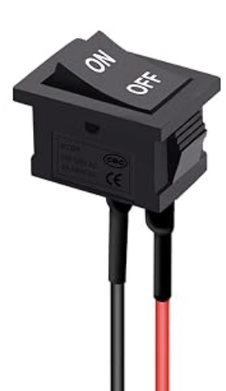

### Fuse (3A to 5A Fast-Blow)
An intentional "weak link" in the circuit containing a tiny wire calibrated to melt quickly if too much electrical current flows through it.  Sits right next to the positive battery terminal to protect against dead short circuits. If a wire accidentally bridges positive to negative, the fuse melts in milliseconds, stopping $70\text{A}+$ of battery power before wires melt or catch fire.

Functions like a **burst disc or pressure-relief safety seal**. If flow rate or pressure surges dangerously out of control, the seal intentionally breaks open, dumping energy harmlessly and shutting down the system before main pipes burst.

  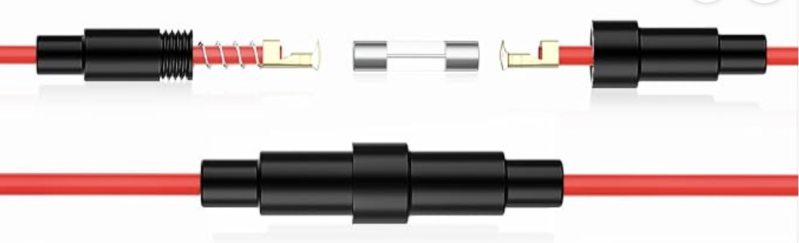

### DC Motor Starting and Stopping Dynamics
The sudden surges and electrical spikes caused when an electric motor starts spinning up or suddenly slows down.

Starting the motor is like **opening a massive fire hydrant suddenly**—for a split second, water pressure across the rest of the neighborhood collapses until the water gets moving. Stopping the motor quickly is like slamming a valve shut on rushing water, causing a sudden shockwave (**water hammer**).

* **Function in Circuit:** 
  * **Startup Surge:** When a motor is completely stopped, it acts almost like a solid wire short-circuit for a fraction of a second, drawing a sudden spike of current ($3\times$ to $5\times$ its normal running amount) until it reaches full speed, causing battery voltage to sag.
  * **Electrical Noise & Kickback:** As the motor's internal wire coils spin past magnetic fields and brushes, they generate rapid magnetic collapses that dump voltage spikes (electrical water hammer) back into the power wires.

 If unmitigated, these startup surges and electrical noise spikes can starve the servo motor or trick the computer board into shutting off.

### ESP32 Microcontroller Voltage & Under-Voltage ("Brownout")
Again, the ESP32 is the brain of the boat that processes Wi-Fi commands and controls the steering and motor speed. Requires a stable 3.0V to 3.6V directly at its microchip (supplied via the +5V power rail through an onboard regulator).

Think of the processor like a **high-precision waterwheel controller** that requires a steady stream of water at a minimum pressure head to run smoothly.

* **Impact of Under-Voltage (Brownout):** If a motor surge causes supply pressure to drop below 2.8V, the waterwheel stops turning properly. To protect itself from erratic behavior or data corruption, the ESP32 triggers a **Brownout Reset**—instantly rebooting, dropping its Wi-Fi connection, and stopping all controls until steady pressure returns.

### Servo Motor Voltage Range
Again the small motorized actuator that turns the boat's rudder to steer left and right. Requires 4.8V to 6.0V to operate smoothly (and will fail or freeze if voltage drops below 4.0V).

Functions like a **hydraulic piston**. It needs a minimum level of steady pressure to push against the resistance of the water swinging the rudder.

Servos require brief spikes of power to change physical position. If main pressure sags below operating thresholds, the hydraulic piston loses strength—causing the servo to freeze, twitch, or stop steering entirely.

## Wiring 
For learning purposes lets take the wiring in stages. The first stage is a step up from the previous wiring diagram but is lacking some of the protections we will have in the final. This first stage is shown below.

  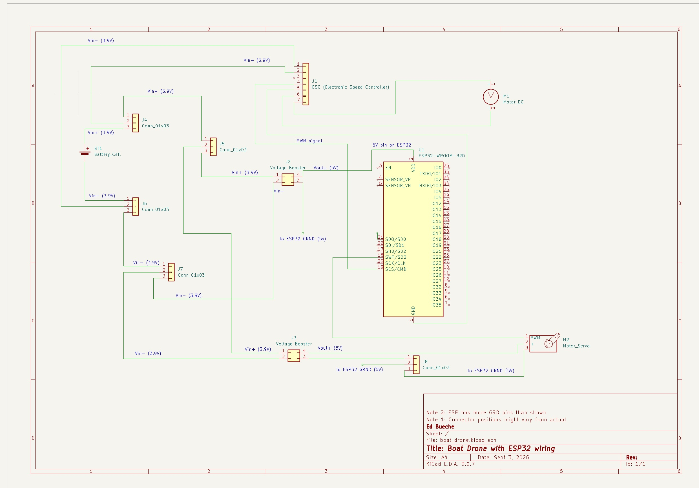

This basically works, but lacks a fuse and a switch mechanism. And its highly likely that if you crank up the motor to spin fast, that the servo's will stop working.

So, the final wiring is shown below. In this upgraded version we have added the switch, the capacitors, and the fuse. The physical is also shown along with a couple of close up's of the capacitor connections.
The wiring is illustrated below, both the logical and example physical pictured below. 

  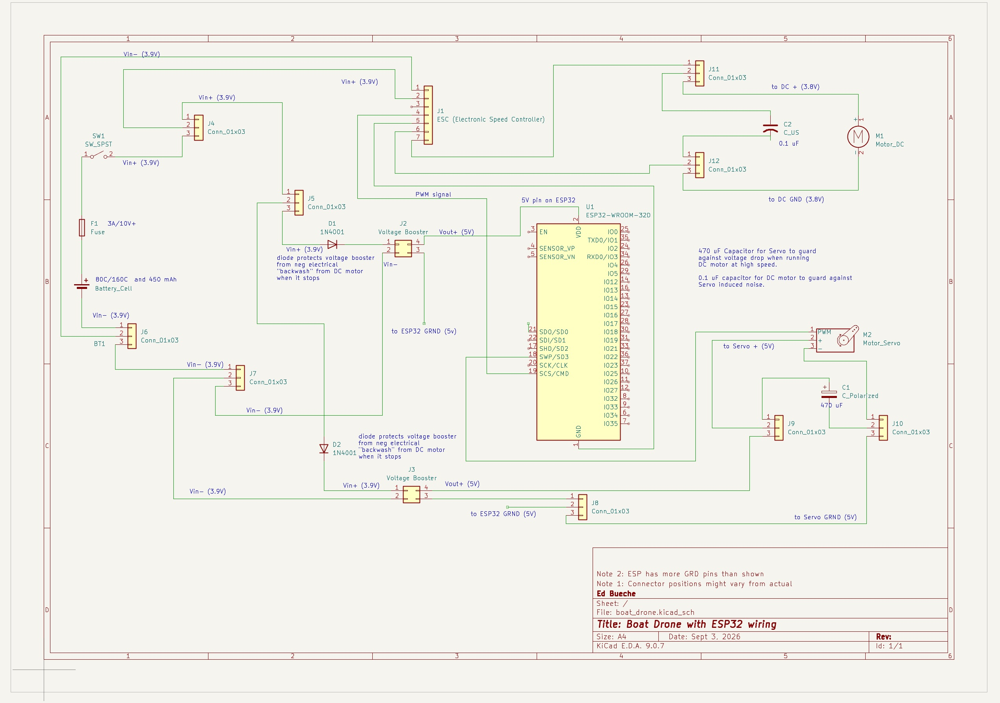
  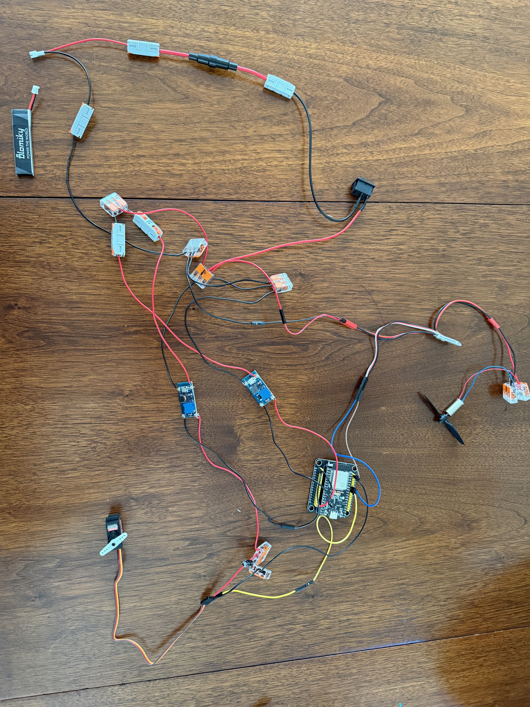

## Summary of steps

There are several ways to approach this task. Lets first assume that we will do the two stages of the wiring and test both.

### Phase 1: initial battery-powers-all wiring
This section assumes you are starting from the previous tasks wiring (i.e., this [wiring diagram with the battery powering only the DC motor](./images/boat_drone_dev.jpg)).

**Note to Jeremy: the wiring I mailed you has this configuration.**

### Phase 1 testing

  

**Important: Make sure the propellor can spin freely**. In the earlier picture it could not. 

#### Test 1: throttle slow 
First turn on the dc motor. Press the forward slow button on the phone. It should spin reasonably fast (but could spin faster). The display should look as shown. Notice the status.

  

#### Test 2: DC motor can stop
Touch the "Stop motor" button and you should see the motor stop spinning.

#### TEST 3: Servo turns
While the DC motor is not spinning, confirm that the servo controls on the app still work correctly for servo.

#### TEST 4: DC motor and Servo
Turn on the DC motor and then confirm you can control the servo motor at the same time. This test might fail due to the voltage drop discussed above.

#### TEST 5: throttle fast and servo
Turn on the throttle to fast from slow and from stop. Also try to move the servo. 

Again, this test will likely fail due to the interference noted above. Failure means either that the dc motor stops, the servo stops moving, or the wifi reboots

### Phase 2: Final battery-powers-all wiring
This section assumes you are starting from the initial battery-powers-all wiring as shown in the [earlier wiring diagram](./images/boat_drone_wiring.jpg).

The steps are annotated below.

  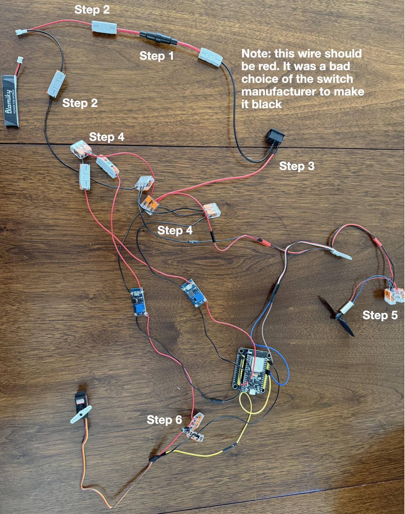

1. Connect the 3A fuse into the fuse containing wire expose a bit more wiring on the ends of this.
2. Connect the battery's female connector positive wire to the fuse wire and the negative one to a 3-way connector.
3. Connect the switch wire to the other end of the fuse wire. Note, again, the switch wire coloring of black and red are really unfortunate. Both ends of the switch are positive so they both should have been red. Normally you would never connect a black wire to a red wire as it would cause a short. So if you feel compelled to wrap the black wire with some red electrical tape this would bring the universe back into balance.
4. Separate the pos and negative flows to the various electrical components. The flows that are going to the ESP32 and the servo need to have diodes inserted (see picture below). Also, wire up the negative flows.

  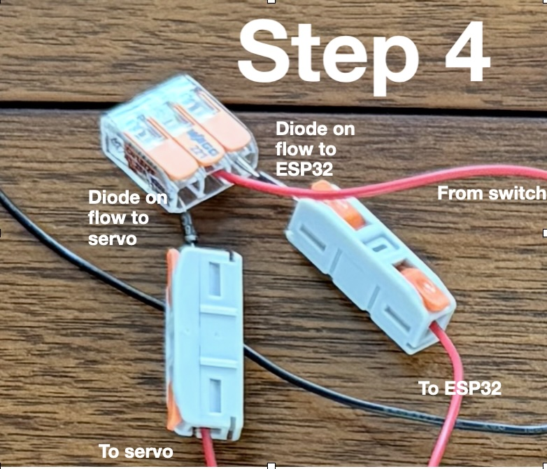

5. Wire up the small 0.1 uF capacitor to the motor. This is illustrated below. Again, the longer wire should be in the positive flow and the shorter wire on the negative one.

  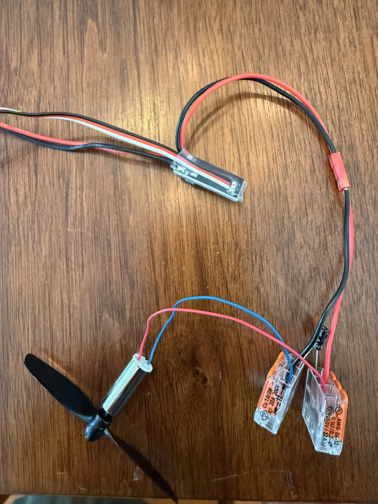

6. Wire up the larger 470 uF capacitor to the servo flow. This is illustrated below. Longer wire should be in the positive and the shorter in the negative flow.

  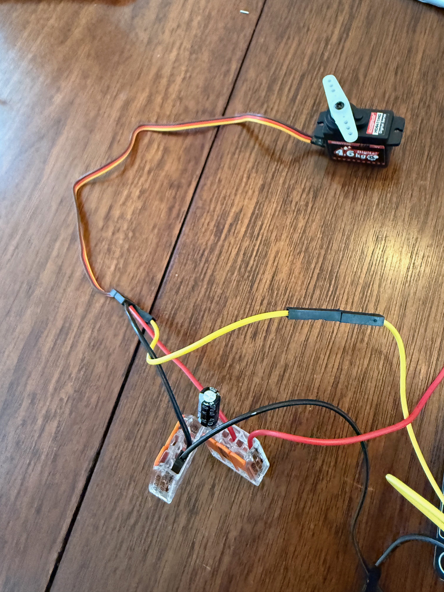

## Phase 2 testing
- redo tests 1 - 5.
- If you didn't see any issues with the phase 1 testing, then pull the 470 uF capacitor out of the circuit and attempt to tests 1 - 5 again. Re-insert the capacitor afterwards.

