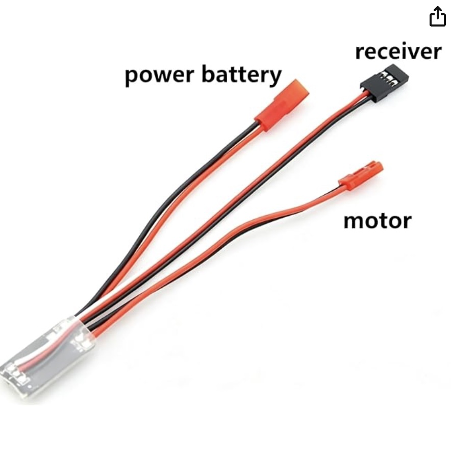
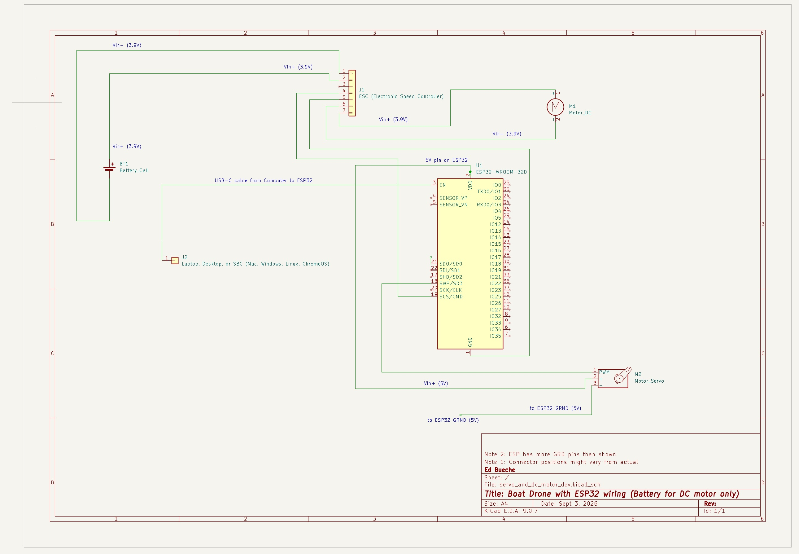

# DC motor and battery hookup

In this task we add in the DC motor that will provide the thrust for the boat (drive the propellor). The electrical circuit we will setup, will be simpler than our final circuit. We will introduce not only the DC motor but also the battery that will ultimately power all of it.

## Background

There are a few concepts that are useful for this section.

### Battery
A battery stores chemical energy and converts it into electrical energy that can power a circuit. A battery has two terminals, positive (+) and negative (−). When connected in a complete circuit, the battery provides the voltage that causes electrical current to flow. In our airboat, the battery supplies the electrical energy needed by the electronics and motors.
### Voltage
Voltage is the electrical difference between two points that can cause current to flow. It is measured in volts (V). A useful analogy is water pressure: higher voltage is somewhat like having greater pressure available to push water through a pipe.

### Current
Current is the flow of electric charge through a circuit. It is measured in amperes (A), often called amps. Using the water analogy, voltage is like the pressure, while current is like the amount of water flowing through the pipe.

Motors typically require much more current than small electronic components. This is why we generally don't try to power a motor directly from an ESP32 output pin.

### Ground (GND)
Ground, usually labeled GND, is the common electrical reference point that we call 0 volts. Different parts of a circuit often need their grounds connected so that they agree on what their electrical signals mean.

For example, if an ESP32 sends a control signal to a servo, the ESP32 and servo normally need to share a common ground. Otherwise the servo may not be able to correctly interpret the voltage of the ESP32's signal.

### DC Motor
A DC (Direct Current) motor converts electrical energy into continuous rotational motion. Apply power and the shaft spins. Changing the amount of power can change its speed, and reversing the electrical polarity can reverse its direction.

A regular DC motor generally does not know what angle its shaft is pointing toward. It is mainly designed to spin.

This is different from the servo motor we discussed earlier. A servo is normally commanded to move to a particular position or angle and then hold that position.

A useful distinction for the students is:

DC motor → “Spin at this speed.”
Servo motor → “Move to this position.”

### ESC — Electronic Speed Controller
An Electronic Speed Controller (ESC) is an electronic device that controls the speed of an electric motor. The battery supplies the motor's electrical power through the ESC, while a much smaller control signal from the ESP32 tells the ESC how fast the motor should run.

In our airboat, the connections can be thought of as:

Battery → ESC → Propeller Motor

while the control path is:

ESP32 → control signal → ESC → motor speed

This is important because the ESP32 cannot provide enough electrical current to power the propeller motor directly. Instead, the ESP32 tells the ESC what to do, and the ESC controls the much larger amount of power flowing from the battery to the motor.

An ESC often uses a control signal similar to the signal used to control a servo. For example, different pulse widths can represent stop, slow, medium, and full speed.

This is illustrated below. It has a total of 7 pins spread over three cables:
- *motor*: This two prong female connector should be connected to the positive/negative lines of the DC motor. 
- *power battery*: This two prong male connector should be matched with two female connectors coming from the battery (pos/grnd). 
- *receiver*: This three pin connector will have the grnd pin and the signal wire connected to the ESP32 grnd and pin 19 respectively. 

IT IS SUPER IMPORTANT NOT TO CONNECT A POS WIRE TO A NEGATIVE (GRND) ONE ... ESPECIALLY WHEN WORKING WITH THIS BATTERY. IT WILL LEAD TO A SHORT CIRCUIT. ALWAYS DOUBLE CHECK YOUR WIRING BEFORE CONNECTING THE BATTERY.

We are not using a whimpy batter.

  

## Hardware
- ESP32
- Servo
- DC motor 
- battery

## Wiring

Now, as noted above we are not powering the dc motor using the ESP32's 5V pin (like the servo motor previously). This is because it needs more current than can be supplied by that pin. Hence, we introduce a battery, which is a special battery designed to be light weight and high-power for quad coptor drones. 

The wiring is illustrated below. This is our "dev" wiring, because the ESP32 and servo are still getting powered by the USB from the development computer. We will change this to be all powered by the battery later (so that it all fits into the boat).

  

## Summary of steps

1. wire up the DC motor to the ESC motor line
2. Connect the ESC receiver to the ESP32
3. Connect the battery to the ESC battery line
4. connect the USB from the dev PC to the ESP32 
5. compile the `firmware/servo_http/servo_http.ino ` sketch
6. upload the sketch to the ESP32
7. Connect phone to esp32 wifi
8. open browser and go to http;//192.168.4.1/
9. test

## Program Steps

### Compile the servo_http

### Upload the servo_http to the ESP32

### Test

