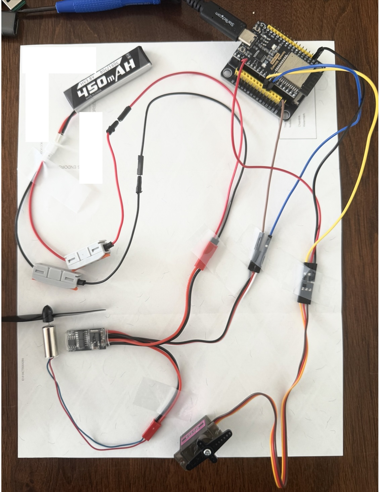
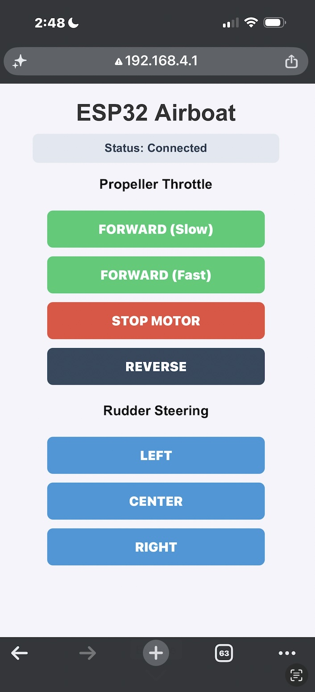
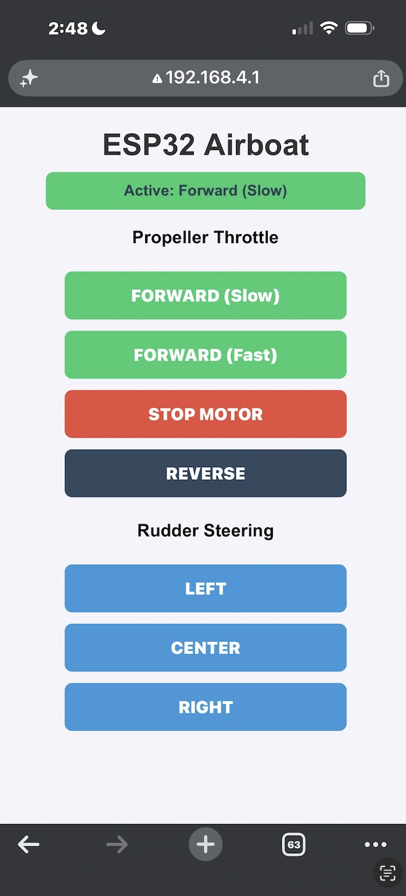
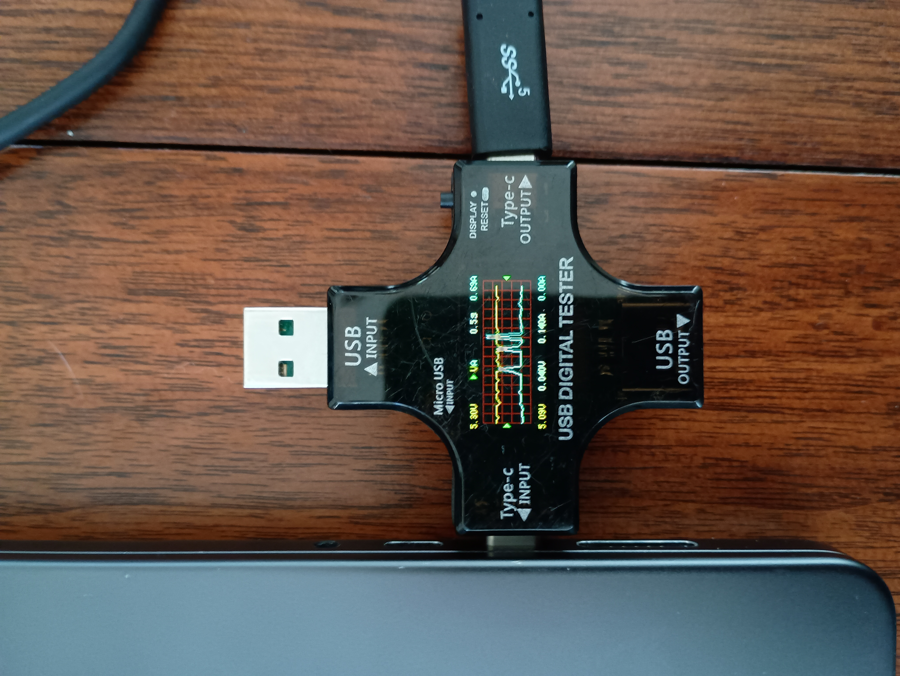
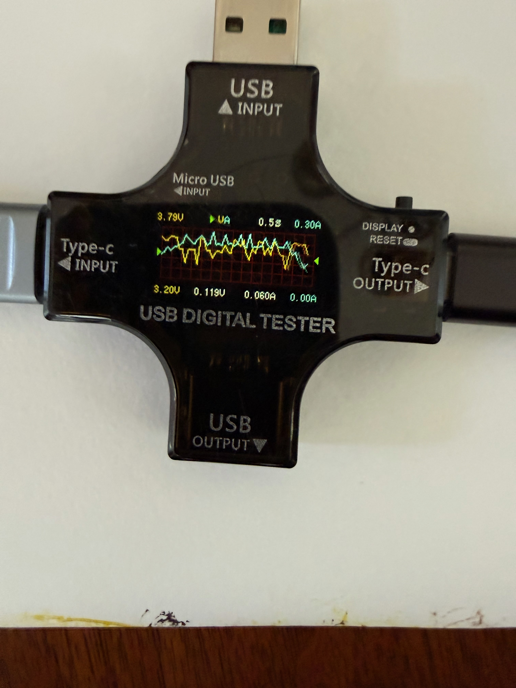

# DC motor and battery hookup

In this task we add in the DC motor that will provide the thrust for the boat (drive the propellor). The electrical circuit we will setup, will be simpler than our final circuit. We will introduce not only the DC motor but also the battery that will ultimately power all of it.

## Background

There are a few concepts that are useful for this section.

### Voltage
Voltage is the electrical difference between two points that can cause current to flow. It is measured in volts (V). A useful analogy is water pressure: higher voltage is somewhat like having greater pressure available to push water through a pipe.

### Current
Current is the flow of electric charge through a circuit. It is measured in amperes (A), often called amps. Using the water analogy, voltage is like the pressure, while current is like the amount of water flowing through the pipe.

Motors typically require much more current than small electronic components. This is why we generally don't try to power a motor directly from an ESP32 output pin.

### Battery
A battery stores chemical energy and converts it into electrical energy that can power a circuit. A battery has two terminals, positive (+) and negative (−). When connected in a complete circuit, the battery provides the voltage that causes electrical current to flow. In our airboat, the battery supplies the electrical energy needed by the electronics and motors.

In this project we are using Blomiky 4 Pack 1S 3.8V 450mAh 80C Lipo Battery with PH2.0 Plug Compatible. It has a rating of steady state 80C output and a peak of 160C. This is a special battery to support drones: it can output 36 Amps and is very light. Initially we used a different battery that had much higher overall capacity (3000 mAh vs 450 mAh), but that other battery was quite limited on how much current it output (~ 1 Amp) and it was heavier. This current limit caused issues since the ESP32 + the ESC + the SErvo motor needed more like 1+ Amp when starting. See discussion below: [Why do we need the special 80C/160C batteries for this application?](#why-do-we-need-the-special-80c160c-batteries-for-this-application)

### Ground (GND)
Ground, usually labeled GND, is the common electrical reference point that we call 0 volts. Different parts of a circuit often need their grounds connected so that they agree on what their electrical signals mean.

For example, if an ESP32 sends a control signal to a servo, the ESP32 and servo normally need to share a common ground. Otherwise the servo may not be able to correctly interpret the voltage of the ESP32's signal.

### DC Motor
A DC (Direct Current) motor converts electrical energy into continuous rotational motion. Apply power and the shaft spins. Changing the amount of power can change its speed, and reversing the electrical polarity can reverse its direction.

A regular DC motor generally does not know what angle its shaft is pointing toward. It is mainly designed to spin.

This is different from the servo motor we discussed earlier. A servo is normally commanded to move to a particular position or angle and then hold that position.

A useful distinction for the students is:

DC motor → “Spin at this speed.”
Servo motor → “Move to this position.”

### ESC — Electronic Speed Controller
An Electronic Speed Controller (ESC) is an electronic device that controls the speed of an electric motor. The battery supplies the motor's electrical power through the ESC, while a much smaller control signal from the ESP32 tells the ESC how fast the motor should run.

In our airboat, the connections can be thought of as:

Battery → ESC → Propeller Motor

while the control path is:

ESP32 → control signal → ESC → motor speed

This is important because the ESP32 cannot provide enough electrical current to power the propeller motor directly. Instead, the ESP32 tells the ESC what to do, and the ESC controls the much larger amount of power flowing from the battery to the motor.

An ESC often uses a control signal similar to the signal used to control a servo. For example, different pulse widths can represent stop, slow, medium, and full speed.

This is illustrated below. It has a total of 7 pins spread over three cables:
- *motor*: This two prong female connector should be connected to the positive/negative lines of the DC motor. 
- *power battery*: This two prong male connector should be matched with two female connectors coming from the battery (pos/grnd). 
- *receiver*: This three pin connector will have the grnd pin and the signal wire connected to the ESP32 grnd and pin 19 respectively. 

IT IS SUPER IMPORTANT NOT TO CONNECT A POS WIRE TO A NEGATIVE (GRND) ONE ... ESPECIALLY WHEN WORKING WITH THIS BATTERY. IT WILL LEAD TO A SHORT CIRCUIT. ALWAYS DOUBLE CHECK YOUR WIRING BEFORE CONNECTING THE BATTERY.

We are not using a whimpy batter.

  

## Hardware
- ESP32 - [described earlier](./setup.md#esp32-controller-board)
- Servo - [described earlier](./basic_servo.md#servo-motor)
- DC motor - The YoungRC 8520 Coreless Motor 8.5 x 20mm Brushed Motors+75mm CW CCW Propeller
- battery - Blomiky 4 Pack 1S 3.8V 450mAh 80C Lipo Battery with PH2.0 Plug Compatible with S Free Style RC Quadopter Drone / F4 4 . It as a rating of 80C/160C. 

## Wiring

Now, as noted above we are not powering the dc motor using the ESP32's 5V pin (like the servo motor previously). This is because it needs more current than can be supplied by that pin. Hence, we introduce a battery, which is a special battery designed to be light weight and high-power for quad coptor drones. 

The wiring is illustrated below, both the logical and example physical pictured below. This is our "dev" wiring, because the ESP32 and servo are still getting powered by the USB from the development computer. We will change this to be all powered by the battery later (so that it all fits into the boat).

  
  

## Summary of steps

We assume that the ESP32 and servo motor are wired up from the previous task.
Next steps:
1. wire up the DC motor to the ESC motor line
2. Connect the ESC receiver to the ESP32
3. Connect the battery to the ESC battery line (power now to the ESC)
4. connect the USB from the dev PC to the ESP32  (power now to ESP32 and servo)
5. Arrange the dc motor blade so that it can spin freely
5. compile the `firmware/servo_http/servo_http.ino ` sketch
6. upload the `servo_http` sketch to the ESP32
7. Connect phone to esp32 wifi 
8. open browser and go to http;//192.168.4.1/
9. test

### Testing
Now at this point you should see the full UI as shown below.

  

**Important: Make sure the propellor can spin freely**. In the earlier picture it could not. 

#### Test 1: throttle slow 
First turn on the dc motor. Press the forward slow button on the phone. It should spin reasonably fast (but could spin faster). The display should look as shown. Notice the status.

  

#### Test 2: DC motor can stop
Touch the "Stop motor" button and you should see the motor stop spinning.

#### TEST 3: Servo turns
While the DC motor is not spinning, confirm that the servo controls on the app still work correctly for servo.

#### TEST 4: DC motor and Servo
Turn on the DC motor and then confirm you can control the servo motor at the same time

#### TEST 5: throttle fast
Turn on the throttle to fast from slow and from stop

#### TEST 6: DC motor reverse
From slow and fast speed turn on the motor to reverse.

### FAQ
#### Why do we need the special 80C/160C batteries for this application?

So each of the major components: ESP32, DC motor, and Servo motor all have an operating voltage requirement and can draw different amounts of current when operating. The ESP32 and the Servo motor need 5V while the DC motor can operate on 3.8 V. Their current draw varies, depending on what they are doing. In the pictures below I show examples of the current draw first for the ESP32 + servo and then for the DC motor. 

  
  

The yellow line represents the varying voltage over time (0.5s intervals) and the green line represents the measured current draw. The peak current draw of the ESP32/wifi/servo combination was almost 0.7 Amps  (see top right hand side number) and this peak occured when the servo was moving position. Its steady state was more like 0.14 Amps. 

The DC motor situation is in the second picture above and its peak current draw was 0.30 Amps (top right hand side number). When the motor is running this is pretty much constant draw.

Now, the original battery used in this project had a large reservior of power (3000 milli-Amp hours, mAh) but delivered it through a connection that was no more than 1.5 Amp. This can be determined by its C rating: $3.0\text{ Ah} \times 0.5\text{C} = \mathbf{1.5\text{A}}$ .

Now given what we measured using the USB current monitor (a multi-meter essentially) it would seem like our 3000 mAh battery would work, but in practice it didn't and the ESP32 would constantly crash and the wifi would drop in and out when the motor, servo and ESP32 were powered by the same battery. The issue with our multi-meter is that it was collecting data and averating over 500 msec duration samples. So the peak values were really much higher than what was showing up on the graph. The peak current draw could easily be over 2A which the battery could not provide. The comparison of the two  different batteries is shown below.

| Metric | **3000mAh Battery (Old)** | **450mAh Battery (New)** |
| :--- | :--- | :--- |
| **Capacity ($Ah$)** | $3.0\text{ Ah}$ (Big fuel tank) | $0.45\text{ Ah}$ (Small fuel tank) |
| **Max Continuous Rating** | **$0.5\text{C}$** | **$80\text{C}$** |
| **Max Continuous Current** | $3.0\text{ Ah} \times 0.5\text{C} = \mathbf{1.5\text{A}}$ | $0.45\text{ Ah} \times 80\text{C} = \mathbf{36.0\text{A}}$ |
| **Max Burst Rating** | N/A (Will drop voltage) | **$160\text{C}$** |
| **Max Burst Current** | $\approx 1.5\text{A}$ max | $0.45\text{ Ah} \times 160\text{C} = \mathbf{72.0\text{A}}$ |

But at 36 Amps is this overkill for this application? yes, but it gives us plenty of capacity later for other applications like quad-coptor drones which can have heavier single board computers (SBCs) and multiple DC motors or quadraped rover bots.