# Does the boat float?

The goal of this section is to drive the engineering choices to ensure that the boat floats. This section is motivated by the fact that the electronics and other assessories used in the our original version were too heavy and bulky for the boat. There was no way it would float.

# Definitions

## Mass
The total amount of "stuff" or matter inside an object, measured in grams (g) or kilograms (kg).
Think of mass like the total volume of water molecules squeezed inside a sealed water balloon—no matter where you take the balloon (the pool, the classroom, or the moon), the actual amount of water inside remains identical.
Represents the combined physical material of your RC boat (hull, battery, ESP32, motors, and wiring). 

## Weight
The downward pulling force exerted on an object's mass by gravity, measured in Newtons (N) or grams-force.
Imagine holding that same water balloon in your hand. Weight is how hard the balloon pushes down against your palm because Earth's gravity is pulling on it.
Weight is the force pulling your boat straight down toward the bottom of the pond. For the boat to float, this downward force must be completely balanced by an equal upward force.

Now the difference between weight and mass can seem confusing. A kitchen scale is measuring weight but its units are grams, not grams-force or Newtons but often in  pounds (lbs). Pounds (lbs) are a measure of force. But the scale assumes you are standing on the surface of earth. So when displaying grams we will say that a scale approximates the mass of an object. Or in the case of a scale is really showing the grams-force weight of the object. The diagram below kind of illustrates the differences between weight and mass by considering an object with a certain mass, that is weighed on mars and earth.

  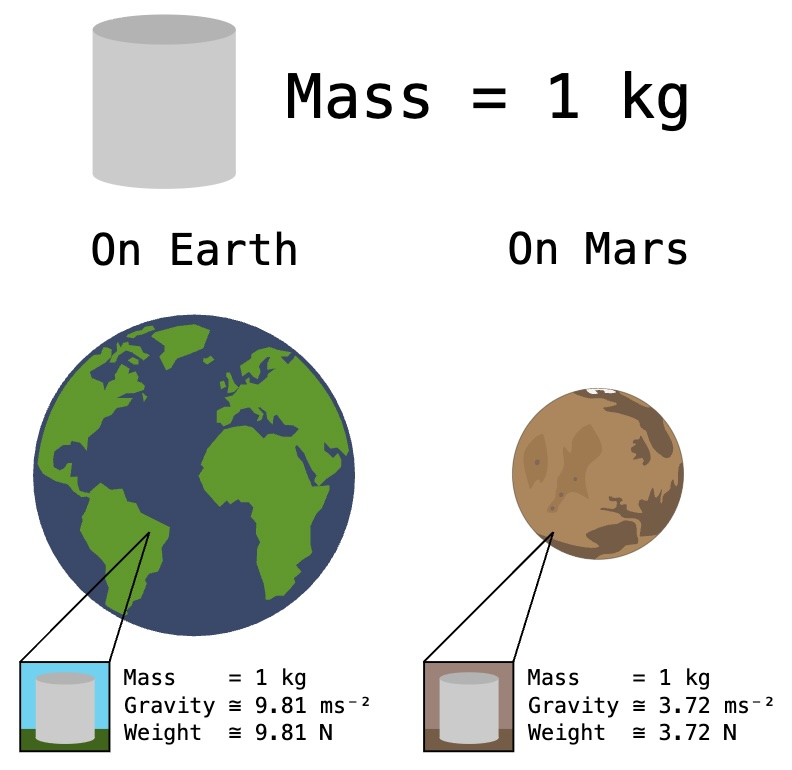

## Buoyancy (Buoyant Force)
The upward push exerted by a fluid on any object placed in it.
Think of trying to push an empty plastic soda bottle straight down under water. The strong upward push forcing the bottle back up to the surface is the buoyant force.
Buoyancy is the invisible "upward hand" of the water pushing your  boat up. If Buoyant Force = Total Weight, the boat floats. If Weight > Buoyant Force, the boat sinks.

  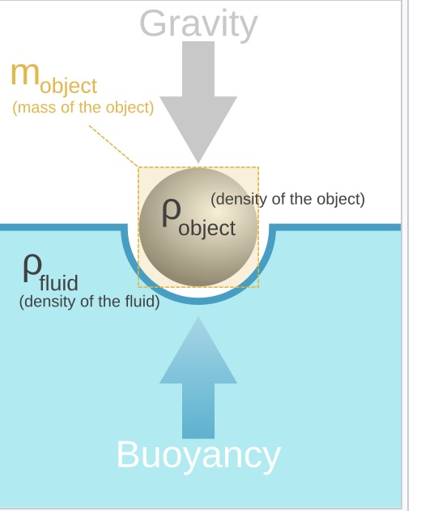

## Displacement (Archimedes' Principle)
The physical moving aside of water when an object enters it. Archimedes' Principle states that the upward buoyant force on an object equals the weight of the water it pushes out of the way.
Imagine filling a bathtub to the very brim. When you climb in, water spills over the edge onto the floor. The weight of that spilled water equals the exact upward lifting force you feel on your body in the tub.
To float a 300-gram RC boat, the hull shape must push away at least 300 grams (300 mL) of water before the waterline reaches the top edge of the hull.

  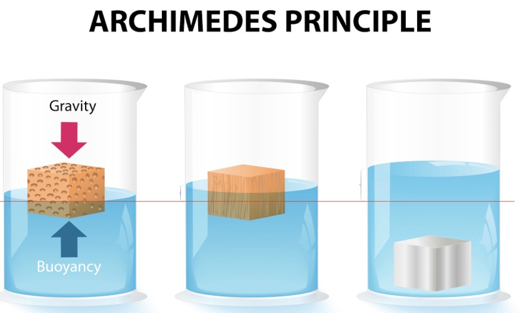

## Density
How tightly packed the mass inside an object is within its volume ($\text{Density} = \frac{\text{Mass}}{\text{Volume}}$). 
Compare a sponge to a solid brick of the exact same size. The brick has high density (tightly packed matter) and sinks immediately, while the sponge has low density (lots of trapped air pockets) and floats easily.
Pure water has a density of $1.0\text{ g/cm}^3$. If your overall boat's average density (total weight divided by total hull volume) is less than $1.0\text{ g/cm}^3$, it floats; if it is greater than $1.0\text{ g/cm}^3$, it sinks.

## Center of Gravity (CG) vs. Center of Buoyancy (CB)
Center of Gravity (CG) is the single point where all the downward weight of the boat is balanced.

Center of Buoyancy (CB) is the geometric center of the submerged portion of the hull where the upward water force pushes.

Think of a seesaw. If the heavy ESP32 sits too high above the water's pushing point (CB), the seesaw becomes top-heavy and flips over instantly.

These determine the boat stability. Placing heavy components (like the LiHV battery  and ESP32) as low as possible in the hull keeps the Center of Gravity below the Center of Buoyancy, preventing the boat from capsizing when making sharp turns.

## Draft & Freeboard
 
Draft is the distance from the bottom of the hull up to the waterline (how deep the boat sits in the water).

Freeboard is the distance from the waterline up to the top edge (gunwale) of the hull.

Imagine a bucket floating in a pool. Draft is how much of the bucket is submerged under water; Freeboard is the safety margin of dry bucket wall remaining above the water surface.

Provides your safety margin against flooding. If you add heavy electronics and increase the boat's mass, the draft increases and the freeboard decreases—leaving less safety clearance before waves splash over the sides into the hull.

  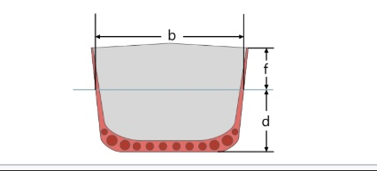

## Activities

### Weighing just the elecronics
So based on our definitions above, we want to know first if the original boat size could provide enough buoyancy force to keep the electronics afloat. There has been several changes to the electronics, but for simplificty lets take our final version from the earlier work. If we weigh just the electronics we find that they have mass of 140 g (as approximated by the scale). This is shown below.

  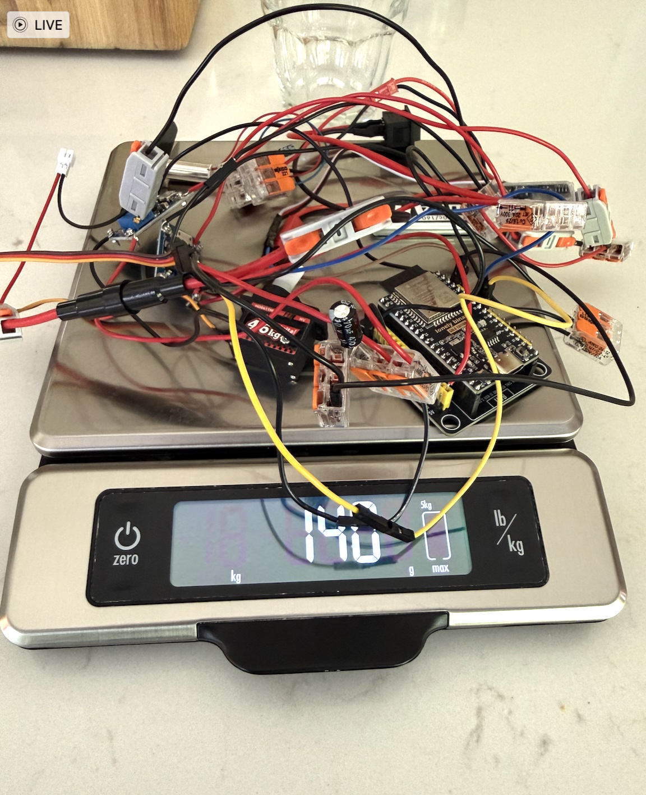

How much do your electronics weigh? (or how much mass do they have approximately?)

### Can the original boat float with the electronics?

So, now we need to determine how much weight the boat can carry before it sinks. There are two equivalent ways to do this. First, you can take a collection of nails or screws and add them to the boat while its in water until it sinks. Given our earlier set of definitions, we can get an equivalent mass measurement by filling the boat with water. At the point it is filled with water the freeboard is zero. You can weigh a glass and then fill it with water that is filling the boat, and then get the difference. When we did this the original boat could carry approximately 76 grams (glass with water from boat (342 g) - weight of empty glass (248g) = 76 grams). So our electronics would easily sink the original boat!

### Resizing the boat
Now, if we make the boat larger then it will hold more mass. How do we know how large to make it? Well for the 3D printer that we have, we were limited to scaling it up by a factor of 1.5 (that is making it 50% bigger in every dimension). Trying to go beyond this caused errors because the boat was too high.

The process to scale the boat up is illustrated below. First, you start with the boat parts as originally sized. Then you select all of the parts. Then hit "s" (for scaled) and enter the scaling factor (going from 100 to 150). Once you hit enter it scales in all dimensions and the new size becomes the new 100 scaling factor.

  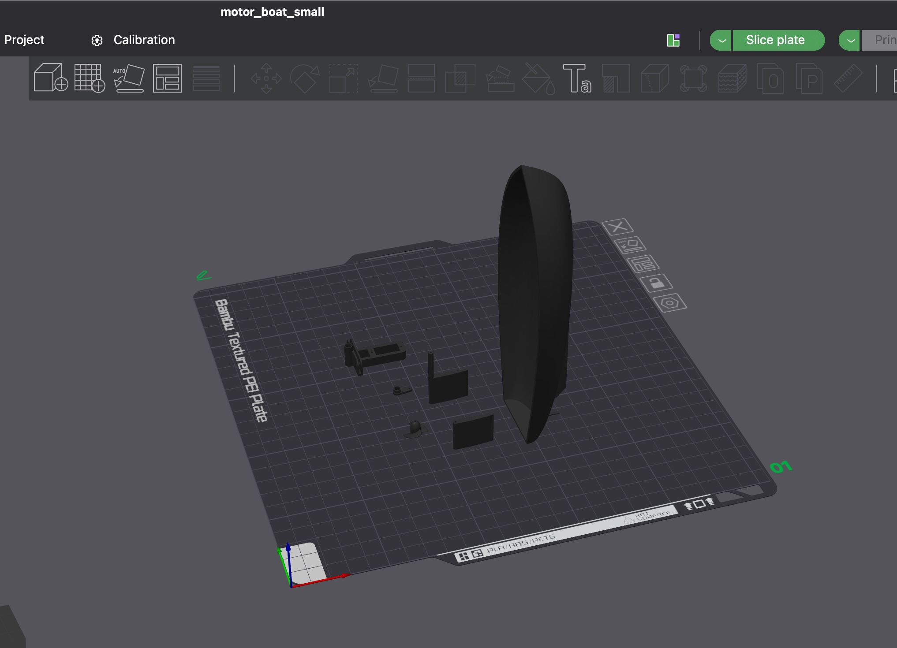
  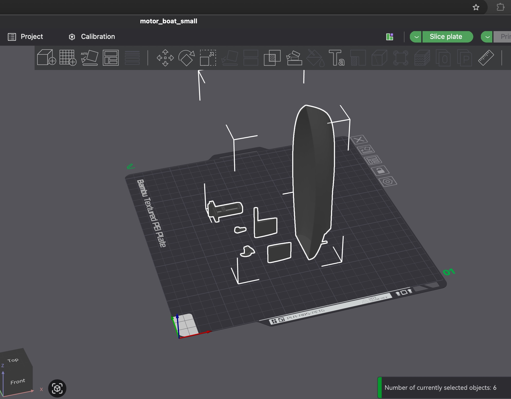
  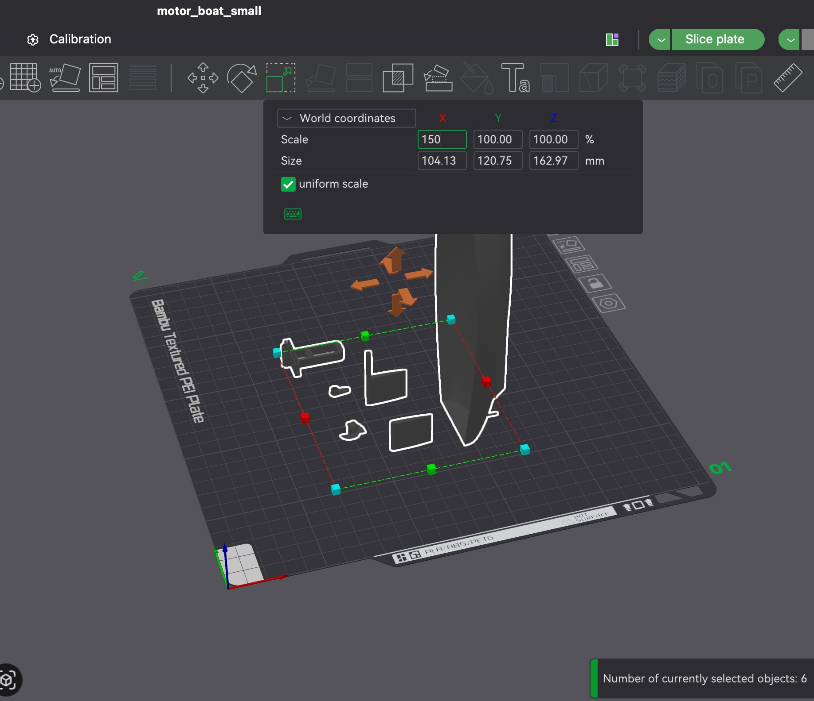
  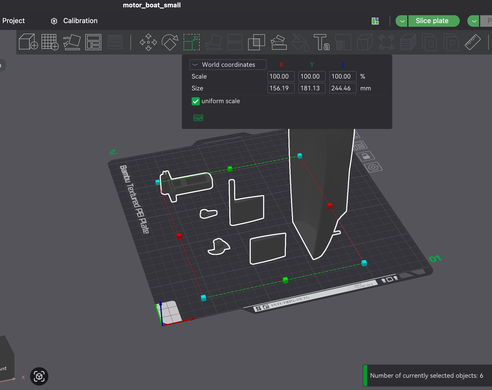
  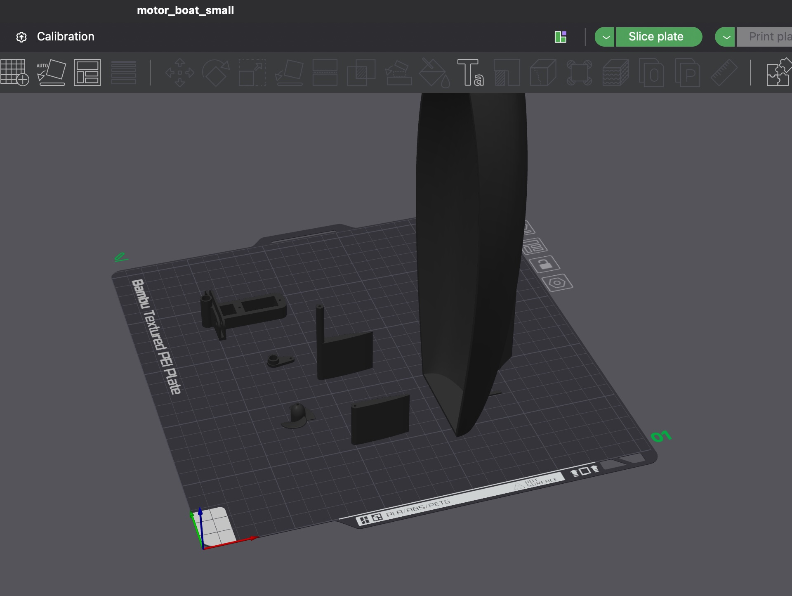

Now if we repeat our capacity test (filling it with water and weighing the water), we find that it can hold a maximum of 252 grams. So given our electronics mass of 140 grams, we have a 100 gram headroom for the boat top, the motor holder, the servo and rudder mechanism, and any other materials needed to keep the boat dry.

The original boat and the 1.5x scaled version are shown below.

  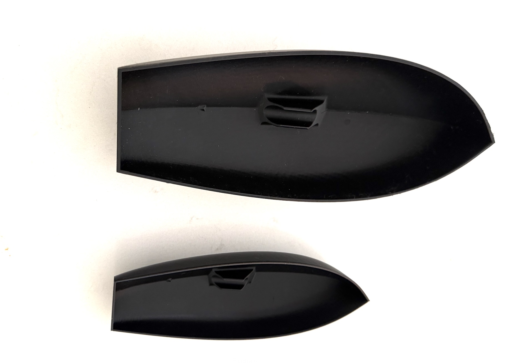

How how much mass can your boat hold? How much headroom do you have?

### Measuring mass of the other parts

So, lets get an estimate of the other parts (as far as we know them). They include: 
- 2x the rudder servo mechanism (used for the dc motor and the servo)
- rudder
- rudder holder
- boat top

First four pieces come in at 24 grams (see below).

  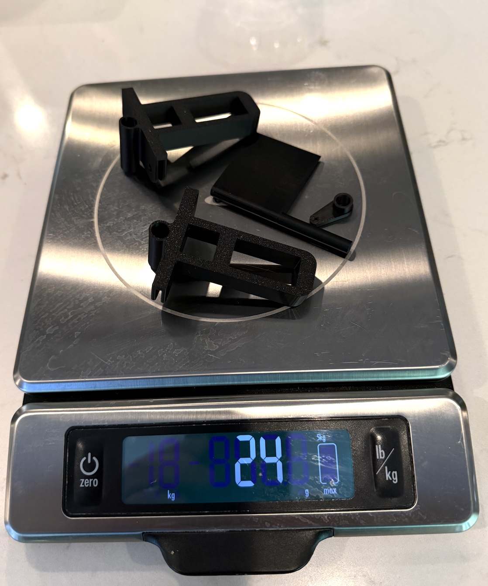

The estimated mass of the top is about 25 grams as well. So our water proofing mass has about 25 to 30 grams to be safe.

## Questions to worry about..

All of this seems like it should play out nicely, but the real world is often not so nice. Here are some questions that ought to be pondered and might cause us to tune things.
1. what is the exact best layout of the electronics in the boat? We could run into trouble with a see-saw event.
2. should we have made our 3D printed boat less denss? we just picked the defaults but could have traded the durability of the structure for a less-dense, more buoyant version.
3. will the speed of the boat impact its draft and freehold? this is likely.
4. In the ocean (or busy lake)  how big of a broadside wave can the boat handle before it tips over and takes in too much water? (we don't expect it to be watertight)
