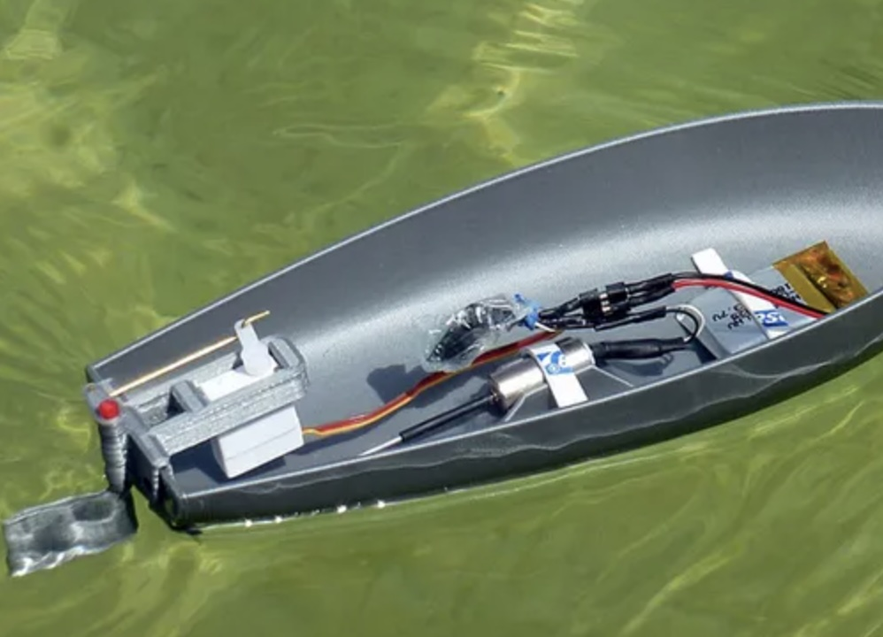
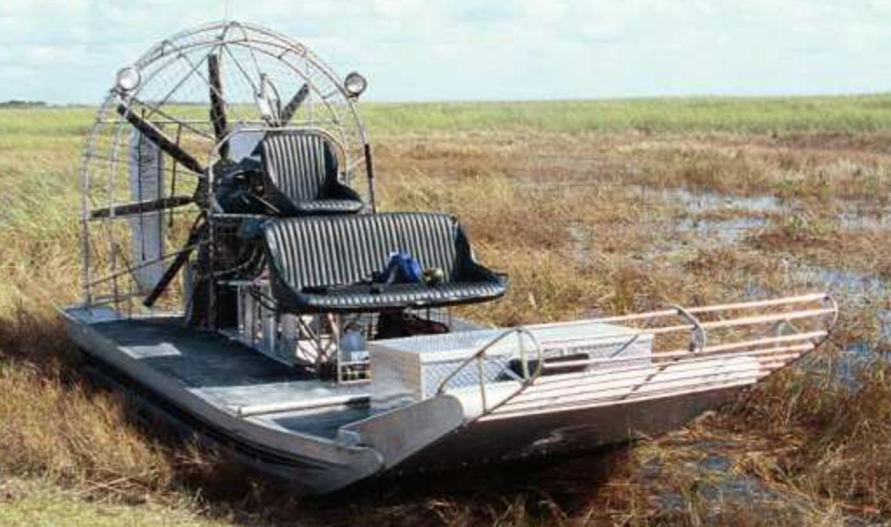
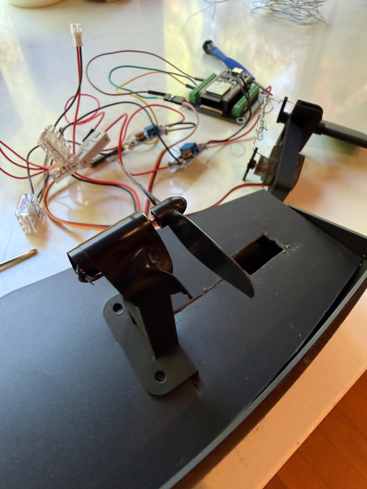

# Propelling the boat

The original concept of the boat (as seen [here](https://cults3d.com/en/3d-model/game/motor-boat-rc-small-experimental)) has the propellor on the underside of the boat.

  

The 3D printed version however does not have a hole in this place to fit the rod that is shown above. This was likely due to the creator drilling a hole through the solid rod area (see below). Executing such delicate surgery on the 3D printed boat would require more precision tools than we care to purchase for this project. Hence, we have decided to build [an airboat](https://en.wikipedia.org/wiki/Airboat) instead: this moves the propellor from the water into the air as shown in the concept picture below.

  

In this task we will explore possible techniques for mounting the DC motor and propellor. Note that this section is likely to be revised later as we work out better mounting techniques.

## Materials
1. Black Plastic Sheet 8 in x 12 in x 0.04 thick
2. Extra servo rudder holder: that is, we are, at the moment going to repurpose the mechanism used to hold the servo and rudder to also hold the dc motor. Hence, an additional one of these is necessary to print. From now on we will refer to this part acting in this role as the dc motor holder.
3. electrical tape

## Overview of task
1. Cut a piece of the plastic sheet in the shape of the top part of the boat. This will function as the ceiling of the boat and anchor our dc motor holder.
2. Cut a center cross hole in this so that the dc motor holder can securely fit into it.
3. Use electrical tape (or the water proof tape) to secure the dc motor to the dc motor holder
4. mount the dc motor holder onto the boat ceiling. Try to ensure it is as level as possible else the boat will list in a particular direction.

The outcome should look something like as shown below.

  

