# Water proofing the boat part 1: electronics

This section is our first effort on water proofing the boat. Our focus will be on the electonics. That is, our goal will be to ensure that the electronics do not get wet (and compromised) if the boat takes on water from the top.  Later, we will explore how to prevent water from entering the boat from the top. 

Now that being said, its appropriate to set expectations: we are not building a boat that is designed to work while submerged, rather, we are trying to ensure that our boat doesn't fail if it gets wet or is briefly submerged. This is more water-resisting than water-proofing. Again, this topic is coverted in great detail in [Underwater Robotics: Science, Design, and Fabrication](https://shop.robonation.org/products/underwater-robotics-science-design-and-fabrication) and we encourage you to read that text in more detail.

In addition, this is likely the most experimental set of tasks and this section is likely going to be revised over time. 

## Definitions

### Properties of water

### Corrosion

### Thermal conductivity

### Electrical conductivity

### Waterproof cord connector joints
These platic joints are used to allow you to encase your electronics while running a wire to another component. The glans we are using are shown (in break out form) below. There are two water proof dynmaics going on here. The first is for the main body, washer and nut to create a water tight seal for the glan to our water proof container. The second is for the clamping jaws and force-tight head to seal the around the protruding wires. A mounted glan is shown in the second picture.

  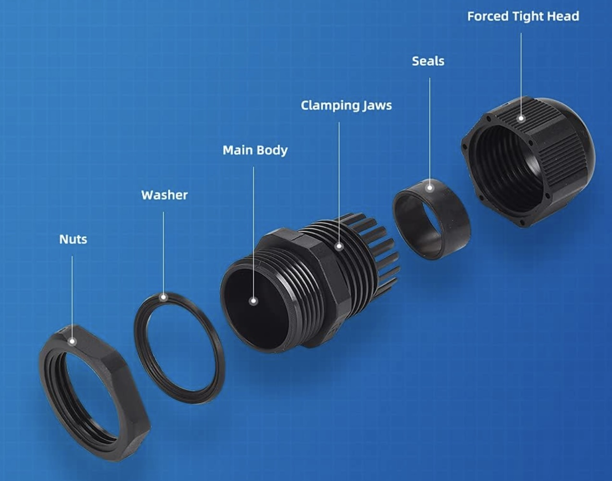
  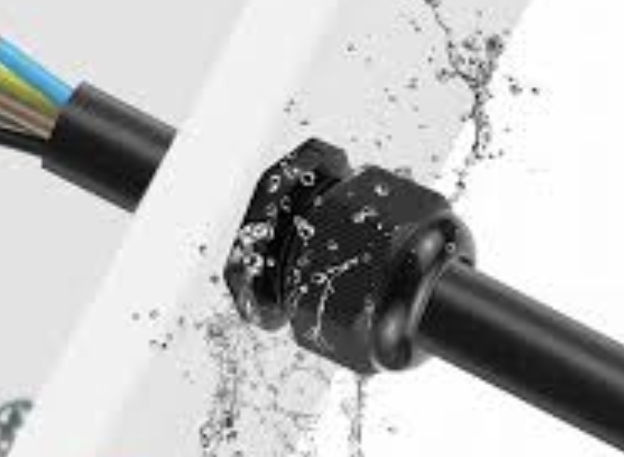

### Waterproof container
Our water proof container will be made of 5.12"W x 8.27"H mylar bags. We chose this because they are durable and flexible. Flexibility is useful given the contours of the boat.

  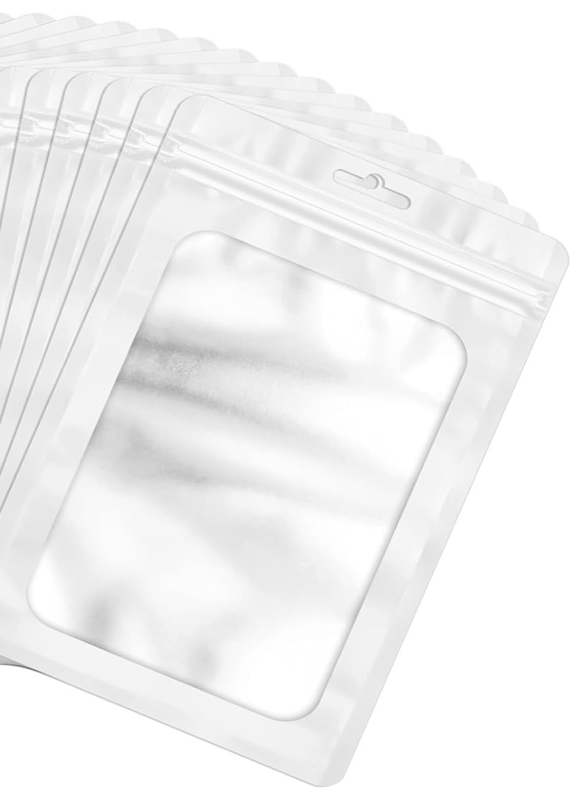

### Electronics in the water-resistant container and electronics outside of it

Our goal will be to keep most of the electronics within a water-tight container, but some of them necessarily have to be outside of it: namely the servo and the dc-motor. Our servo, the HobbyPark Waterproof 12g Micro Servo Motor Metal Gear Arduino Servo Digital Servo Mini 4.6kg High Torque HV, is a special water-proof one (see below). 

  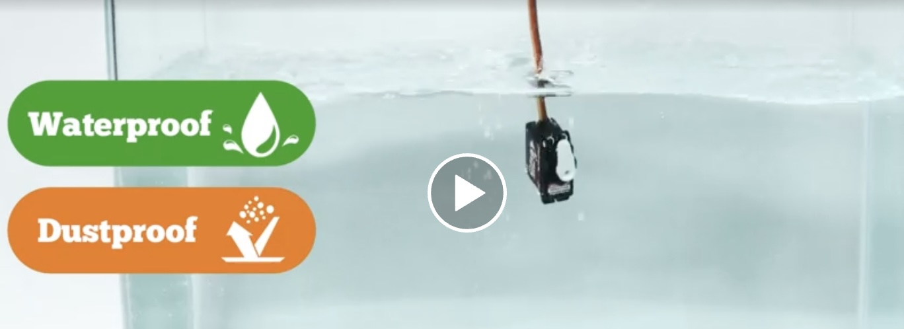

The dc motor is not water proof by design, but in fresh water it should be possible to reuse the motor (after drying) if the boat capsizes. Apparently spraying WD-40 afterwards will be helpful. 

## Tasks
There are a number of tasks in this section and they are outlined below. Then each is detailed later in this page.

1. **Refine our operating requirements**: So our requirements need some detailed refinement with special attention to water proofing. In this task we do that. [See section below](#refining-our-requirements)

2. **Testing the water proofing concept**: Our approach, as noted earlier, is built around fitting our electronics in a mylar bag. In this task we test to verify this will work. [See section below](#detailed-steps-for-water-proof-wiring-test)

3. **High-level design water-resisting electronics**: Ok. assuming the mylar bag concept is sound, how do we design this so that it meets our requirements? [see section below](#high-level-design-for-water-resistant-electronics)

4. **Optimizing the wiring for enclosure**: Our previous wiring was accomplished without much thought to how it was going to fit nicely in the enclosure (and support our refined water-resistant requirements). In this task we work to fix that.

5. **Setting up container**: Ok time to build the final enclosures and fit the electronics in them.

6. **Wet and Dry testing**: There are a number of wet and dry tests we need to do.

## Refining our requirements
There are a number of ways we can secure our electronics, but its helpful to outline some design goals or requirements to help guide our efforts.

- **R1: We should be able to easily change the battery without removing all of the electronics from the enclosure**: Once this is all assembled it would be nice to make it so that we can easily change our battery to recharge it. Having to pull out all of the electronics would be undesirable. 

- **R2: We should be able to easily turn the switch off or on**: This is similar to the above. We will more frequently be turning the circuit off and on. It should be easy to do this. Now  the term "easily" is a little squishy to be in a requirement. In this case we define that to be: there is no need to remove the switch from the enclosure if it is within one.

- **R3: If the boat capsizes for a few minutes, then any electronics within the enclosure shuld remain safe from the water**: We are water-proofing our electronics. If there are some electronics not within the enclosure (servo and dc motor), then unless they are water proof they may fail. 

- **R4: If a person picks up the capsized boat, then they should not risk an electrical shock**: It should be easy and safe to rescue a capsized boat.

- **R5: If the dc motor or servo fails we should able to repace ith without creating a new enclosure**: As noted previously there is a risk that the dc motor might fail if it gets wet (mostly due to subsequent internal corrosion). Hence it would beneficial if we could replace the motor without having to rebuild the enclosure.

## Detailed steps for water proof wiring test

Before sealing our electronics its advisable to test out our water proofing technique. So in this exercise we will just test out the technique. You need a weight, a bag, a single glan, a wire,  electrical tape, plus a pot (to submerge the bag) and water. 

### Step 1: widen our wire
Now our glans wire compression diameter and our wire diameter are mismatched: the glan is to large to seal the wire(s) by itself. Hence we will use electrical tape to widen the wire so it will work. This is shown in the picture below.

  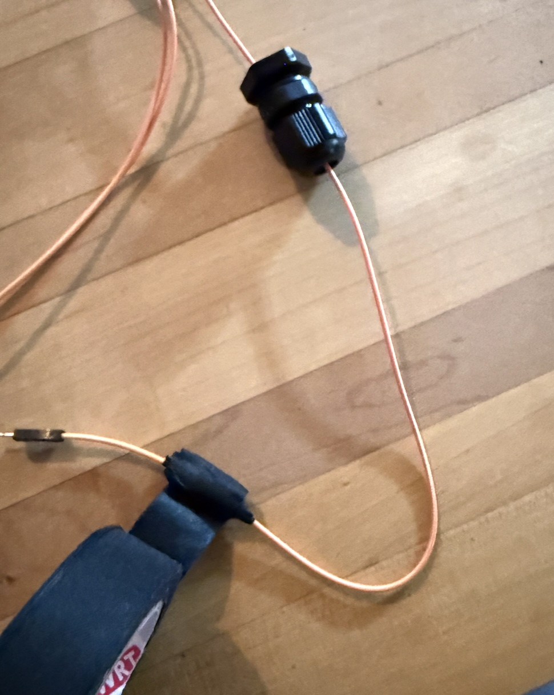

### Step 2: Mount the glan and seal glan to bag

cCut a small hole in the bag and mount the main body into the bag. this is shown below. It is virtuous to make the hole smaller than the main body threads so that you use the flexibility of the mylar to ensure its a tight fit. Its also virtuous to make the hole clean without any tears that could expand later.

  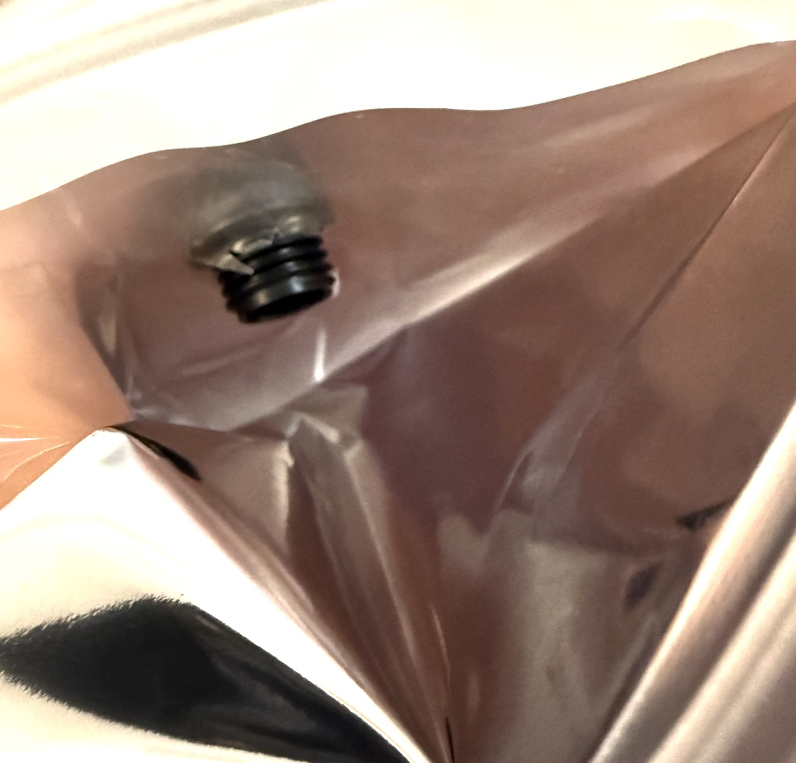

Once the bottom of the main body is pushed through the hole then seal it on the inside by screwing in the nut with the washer as shown in the earlier picture. It is important to twist this tightly so that water won't pass through this hole.

  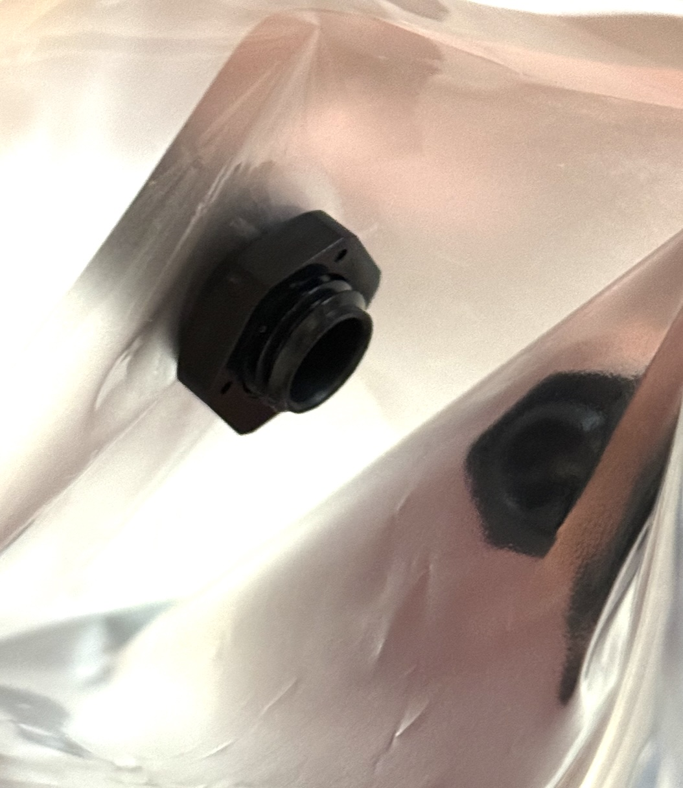

### Step 3: secure the wire in the glan

At this point you can pull or push the wire through the glan hole and then tighten the glan so that it grips on the electrical tape used to widen the wire. Again, tighten securely so that this is watertight. This is shown below.

  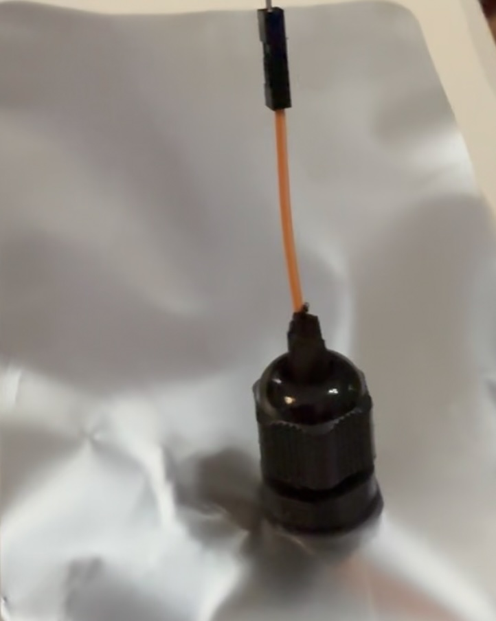

### Step 4: Test and Evaluate

Now its time to test our setup. Put a weight in the bag so it will sink. Then seal the zip-lock top of the bag by pinching it shut. Then submerge it within a pot or sink for a few minutes as shown in the picture below.

  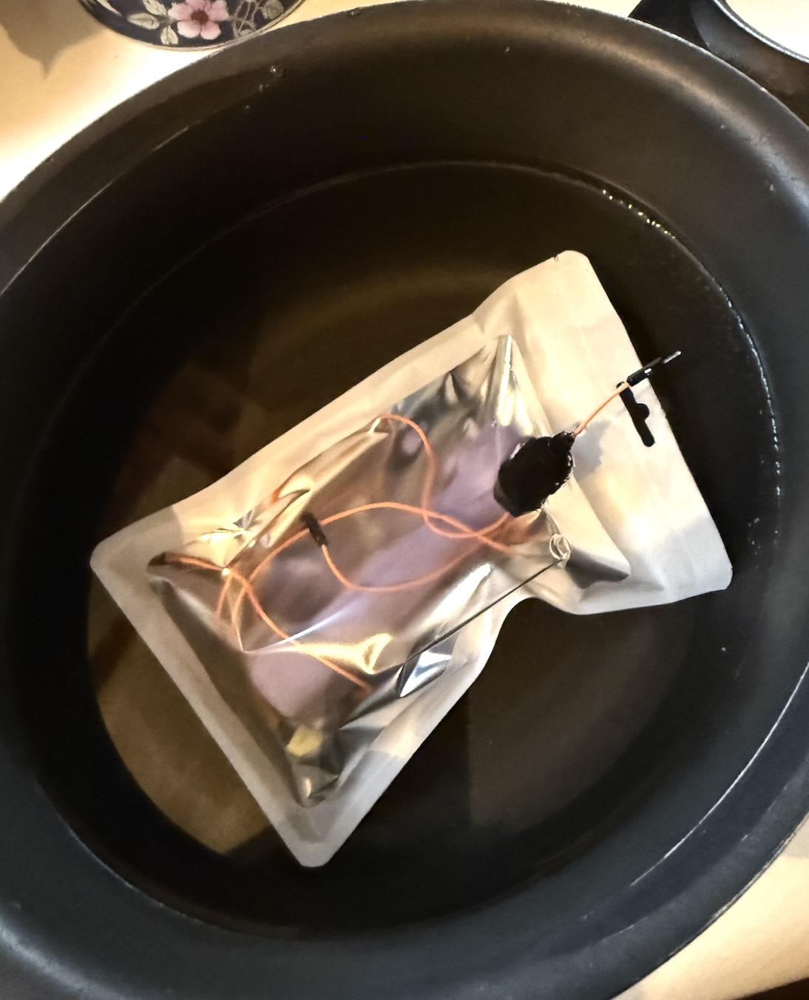

Then retrieve it and let the outside dry. Do not open the bag to see if the inner portion is dry until the outer portion is completely dry (including the top part of the pouch).

  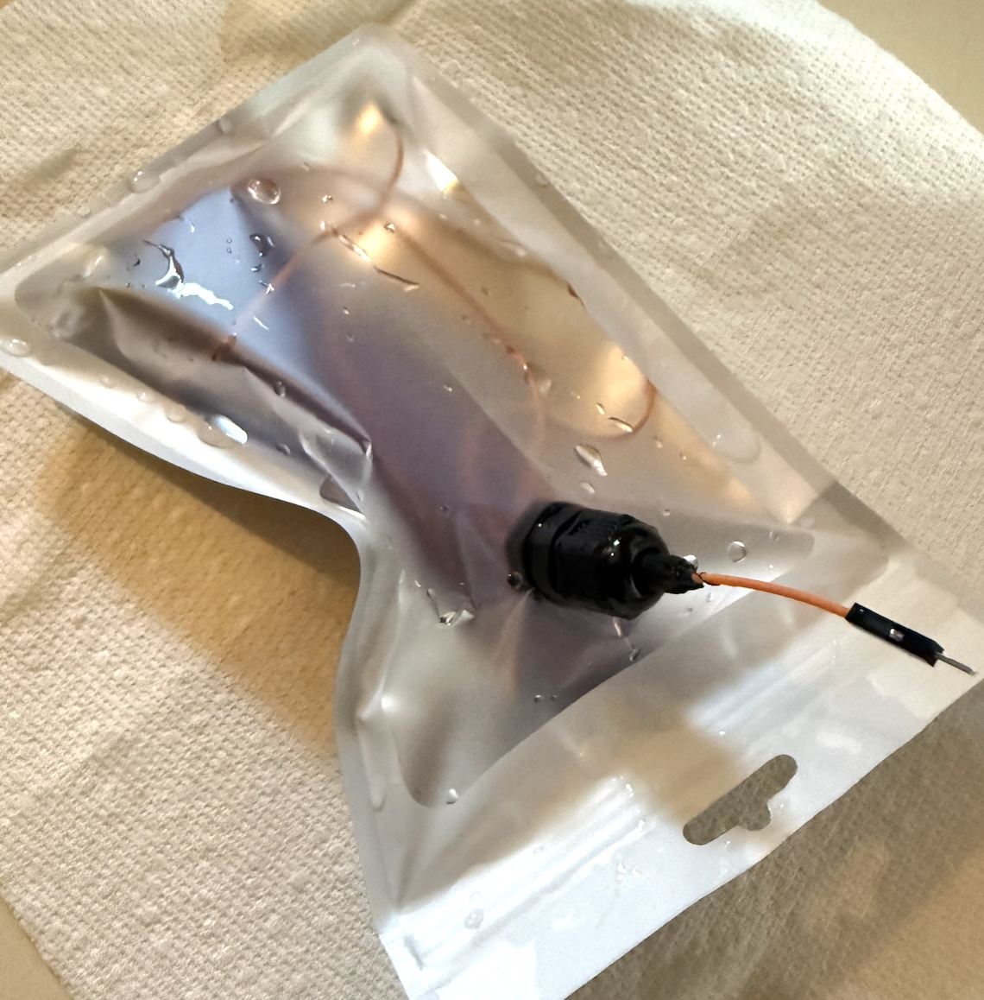

Success? Well, if water got in, then it came in via one of the three entry ways: (1) the top of the zip lock bag,  (2) the electrical tape and wire entrace, and (3) the main body/nut/bag hole. A couple of drops of water is probably ok. A partially filled bag of water, not.

## High-level design for water resistant electronics

The high-level design for our water proof electronics is shown below. We will essentially use two bags. One for the switch, battery, and fuse and the other for the rest of the electronics except for the servo motor and dc-motor.

  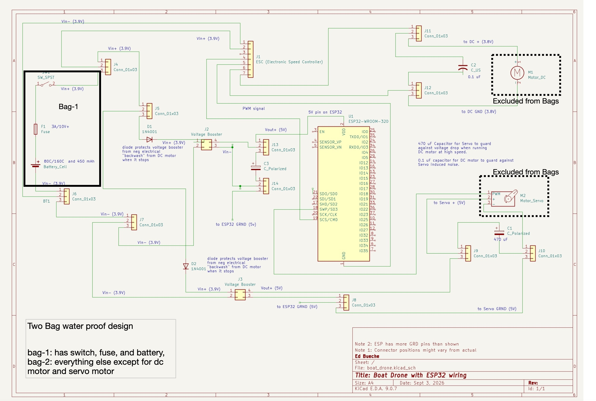

In addition, not shown on the diagram above is a need to connect the two motors to the circuit outside of the bag to ensure that if they fail we don't have to rebuild our water proof enclosure. In addition, it would be beneficial to be able to remove most of the electronics without having to rebuild the enclosure.
