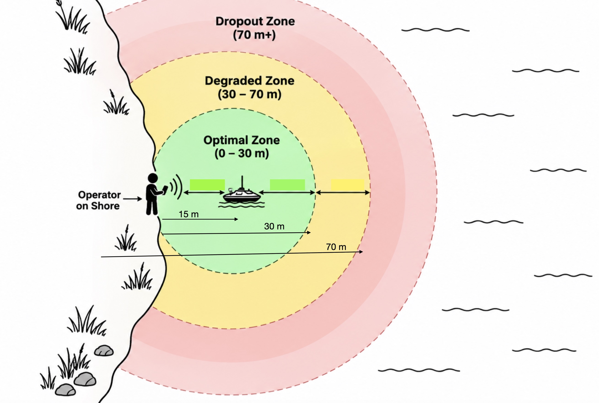
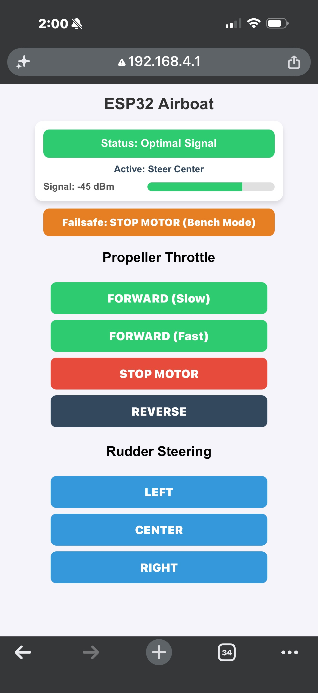
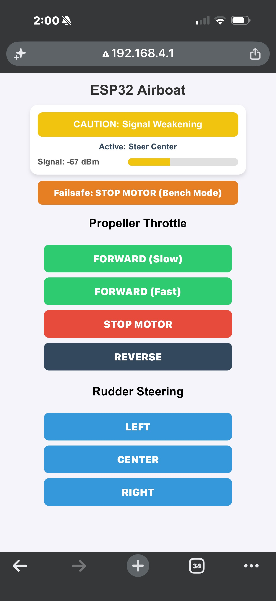
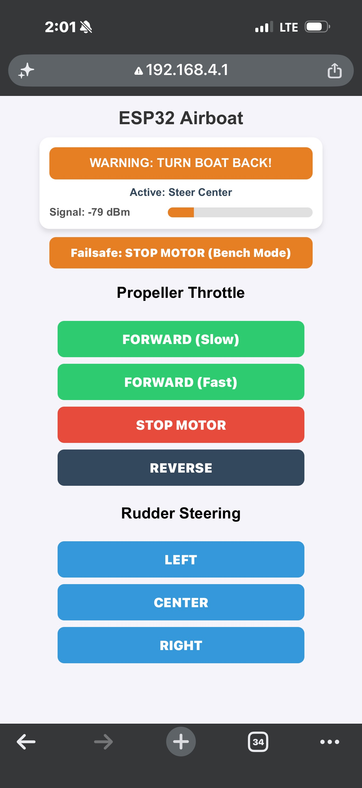
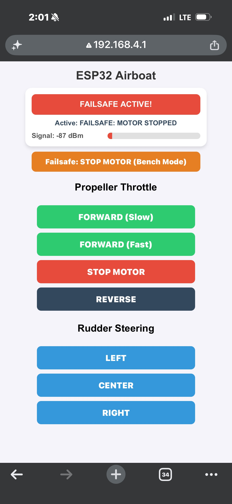
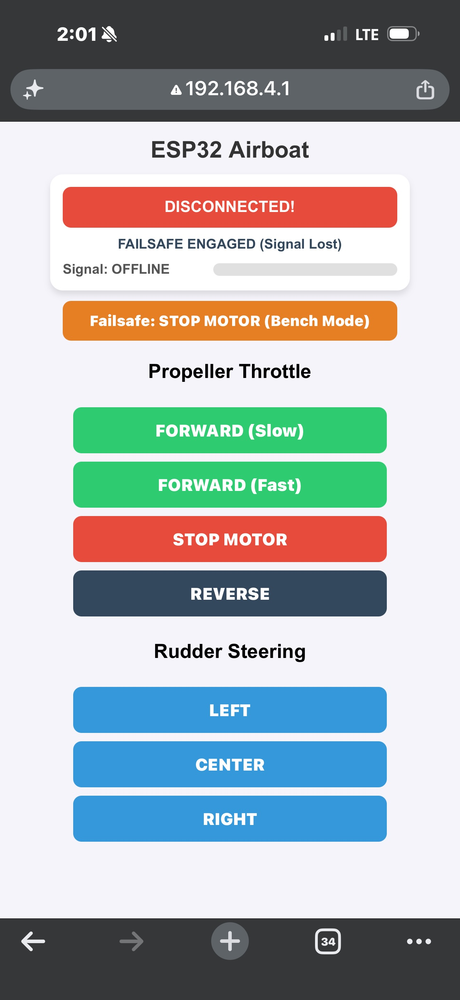

# Wifi range testing

How far can the boat go away from us and still be controlled? What can we do about it if it goes out of range? The communication between the cell phone and the boat is through 2Gz wifi. Think of this as creating a communication circle around the boat and once the boat moves far enough away from the operator the connection will degrade and we can lose total connectivity. The concept is illustrated below.

<p align="center">
  
</p>

In this section we cover these topics.

## Definitions

### wifi

**Wi-Fi** is a way for electronic devices to talk to each other without any physical wires. Instead of sending electrical signals through a copper cable, devices convert data into invisible **radio waves** that travel through the air. In your boat project, Wi-Fi allows your smartphone to send steering and throttle commands directly to the ESP32 chip inside the boat.

---

### Antenna

An **antenna** is the physical metal piece that translates electrical signals into radio waves (and vice versa). 
* When your phone wants to send a command, its antenna blasts the message out as a radio wave.
* The ESP32 on your boat has a tiny metal **PCB trace antenna** (a squiggly copper line printed directly on the board) that catches those radio waves out of the air and converts them back into electricity so the computer can understand them.

---

### Wifi end-point

A **Wi-Fi end-point** (or client device) is any device at the starting or ending point of a wireless connection. 
* In your boat setup, you have two key end-points:
  1. **The Smartphone:** The transmitting end-point where you control the boat.
  2. **The ESP32:** The receiving end-point inside the boat that listens for commands and translates them into motor and servo movements.

---

### 2 GZ wifi vs. 5 GZ wifi

Wi-Fi radio waves travel on different speed lanes called **frequencies**, measured in Gigahertz (GHz):

* **2.4 GHz Wi-Fi (Long Distance, Lower Speed):** 
  * Uses longer, wider radio waves. 
  * **Pros:** Travels much farther and passes through physical obstacles (like plastic boat hulls or dry bags) much better.
  * **Cons:** Slower data speeds and more prone to interference from other devices.
  * *Why your boat uses it:* Your ESP32 operates on 2.4 GHz because maximum distance across the water is much more important than streaming high-definition video.

* **5 GHz Wi-Fi (Short Distance, High Speed):** 
  * Uses shorter, faster radio waves.
  * **Pros:** Super fast data speeds with zero lag.
  * **Cons:** Terrible at traveling long distances and gets easily blocked by walls, water, or obstacles.


### wifi signal strength

**Wi-Fi signal strength** measures how loud and clear the radio wave is when it reaches the receiving antenna. It is measured in a special unit called **dBm (decibel-milliwatts)**, which is always represented as a negative number:

* **-30 dBm to -60 dBm (Strong Signal):** The boat is close to shore (0m – 30m). Control is instant and responsive.
* **-70 dBm to -80 dBm (Weak Signal):** The boat is drifting far out (30m – 70m). Signals start getting muffled by water reflections, causing slight control lag.
* **-85 dBm or lower (Dropout Zone):** The signal is too faint for the antenna to hear. The connection drops, triggering your ESP32's automatic motor safety cutoff!

### dBm (decibel-milliwatts)

Decibel-milliwatts (dBm) is an absolute unit of power expressed on a logarithmic scale, referencing 1 milliwatt ($1\text{ mW}$) as the baseline ($0\text{ dBm}$).It is the universal standard in telecommunications, Wi-Fi, and radio frequency (RF) engineering for measuring radio signal strength, transmission power, and signal loss.

## Logarithmic Scale

A **logarithmic scale** is a way of measuring things where each step up on the scale doesn't add a fixed amount—it **multiplies** by a fixed factor (usually 10×).

Instead of counting 1, 2, 3, 4, 5 (a linear scale), a logarithmic scale counts by powers like 10, 100, 1000, 10000, 100000.

---

### Why Do We Use It?

It allows us to fit **enormously huge ranges of numbers** onto a single, clean chart without running out of paper.

* **Linear Scale (Regular Addition):**
  If step 1 is 10 and step 2 is 20, step 3 is 30. You are adding +10 every time.
* **Logarithmic Scale (Multiplication):**
  If step 1 is 10 and step 2 is 100, step 3 is 1,000. Every step is **10 times bigger** than the last.


Why Use a Logarithmic Unit Instead of Watts?  Radio signal power changes by factors of millions or billions as it travels across open space or through obstacles.Linear Scale (Milliwatts): A strong Wi-Fi signal near your phone might be $0.0001\text{ mW}$, while a faint signal at the edge of range might be $0.00000000001\text{ mW}$. Working with so many zeroes becomes tedious and prone to error. Logarithmic Scale (dBm): Instead of multiplying tiny decimals, dBm converts these vast ranges into clean, manageable numbers between $0\text{ dBm}$ and $-100\text{ dBm}$.

TODO: define this in more detail

## Tasks for wifi range testing
1. Compile/upload a new version of the code: `boat_http_rssi`. This will implement the rssi measurement (see below).
```
arduino-cli compile --fqbn esp32:esp32:esp32 ./boat_http_rssi/boat_http_rssi.ino
arduino-cli upload -p /dev/ttyUSB0 --fqbn esp32:esp32:esp32 ./boat_http_rssi

```
2. Take your battery powered electronics outside and power them on.
3. connect to the wifi of the boat and start the propellor (ensure it is in a stable position)
4. using a measuring tape. start walking back 10 meters, 20 meters, and 30 meters and confirm that the boat still can be controlled. does the signal degrade and do you lose connectivity earlier?
5. move beyond this to see when the signal gets spotty. 
6. how far are you when you drop the signal all together? what happens when you lose connectivity?
7. What happens when you fall out of range?

## Outline of the UI in different connection ranges

The UI will output the current signal strength and also show a color coded range These are shown below.

<p align="center">
  
  
  
  
  
</p>

## How the code handles a disconnect event ... and what is the downside to this approach?
Currently once the connection is lost the code will stop the motor (default). The downside of this approach is that the boat might be really far away and hard to reach. So it begs the question: is there a better way to approach this?

There are numerous ways to approach this, but one simple approach that the code supports is to have the boat start to circle in an effort to cause it to come back into range. This involves setting the rudder either left or right and putting the motor into a slow forward movement. 

It is kind of hard to ensure this is working correctly without actually having the rudder on the boat.


## The code changes for RSSI measurement

The ESP32 can measure measure the signal strength of the devices that connect to it. We take advantage of this and return this value in the HTML response sent back to the phone from the ESP32. 

Lets first take a look at the code.
```
cd ~/boat_drone/firmware
cat -n boat_http_rssi/boat_http_rssi.ino
```

Example output:
```
$ cat -n boat_http_rssi.ino 
     1	#include <WiFi.h>
     2	#include <WebServer.h>
     3	#include <ESP32Servo.h>
     4	#include "esp_wifi.h"
     5	#include "soc/soc.h"
     6	#include "soc/rtc_cntl_reg.h"
     7	
     8	// Hardware Objects
     9	Servo rudderServo;
    10	Servo motorESC;
    11	
    12	const int RUDDER_PIN = 18;
    13	const int ESC_PIN    = 19;
    14	
    15	WebServer server(80);
    16	
    17	const char* ssid = "ESP32-Boat-Control";
    18	const char* password = "password123";
    19	
    20	// System State Variables
    21	int currentSpeed = 90;
    22	int currentAngle = 90;
    23	String currentStatusText = "MOTOR STOP / CENTER";
    24	
    25	// Failsafe Mode Configuration: 0 = STOP MOTOR, 1 = CIRCLE IN PLACE
    26	int failsafeMode = 0; 
    27	
    28	unsigned long lastHeartbeat = 0;
    29	const unsigned long FAILSAFE_TIMEOUT = 1500; // 1.5 seconds connection timeout
    30	bool isFailsafeActive = false;
    31	
    32	// Circle Failsafe Settings
    33	const int FAILSAFE_THROTTLE = 100; // Gentle forward crawl
    34	const int FAILSAFE_STEER    = 135; // Hard Right turn
    35	
    36	const char HTML_PAGE[] = R"rawliteral(
    37	<!DOCTYPE html>
    38	<html>
    39	<head>
    40	  <meta name="viewport" content="width=device-width, initial-scale=1">
    41	  <title>ESP32 Boat Controller</title>
    42	  <style>
    43	    body { font-family: Arial, sans-serif; text-align: center; margin-top: 10px; background-color: #f4f4f9; }
    44	    h1 { color: #333; margin-bottom: 5px; font-size: 22px; }
    45	    
    46	    /* STATUS & RSSI CONTAINER */
    47	    #status-card {
    48	      background: #ffffff; padding: 12px; border-radius: 12px;
    49	      margin: 10px auto; max-width: 320px; box-shadow: 0 4px 6px rgba(0,0,0,0.1);
    50	    }
    51	    #status-box {
    52	      font-weight: bold; font-size: 15px; color: white;
    53	      background: #2ecc71; padding: 10px; border-radius: 8px;
    54	      margin-bottom: 8px; transition: background 0.3s;
    55	    }
    56	    #active-cmd {
    57	      font-size: 13px; font-weight: bold; color: #34495e; margin-bottom: 8px;
    58	    }
    59	    #rssi-container {
    60	      display: flex; align-items: center; justify-content: space-between;
    61	      font-size: 13px; font-weight: bold; color: #555; margin-top: 6px;
    62	    }
    63	    #rssi-bar-outer {
    64	      width: 55%; height: 12px; background: #e0e0e0; border-radius: 6px; overflow: hidden;
    65	    }
    66	    #rssi-bar-inner {
    67	      width: 100%; height: 100%; background: #2ecc71; transition: width 0.4s, background 0.4s;
    68	    }
    69	
    70	    /* FAILSAFE TOGGLE BAR */
    71	    #failsafe-bar {
    72	      margin: 10px auto; max-width: 320px;
    73	    }
    74	    .btn-toggle {
    75	      width: 100%; padding: 10px; font-size: 14px; font-weight: bold;
    76	      color: white; border: none; border-radius: 8px; cursor: pointer;
    77	    }
    78	    .mode-stop { background-color: #e67e22; }
    79	    .mode-circle { background-color: #9b59b6; }
    80	
    81	    /* CONTROLS */
    82	    .btn {
    83	      display: inline-block; width: 85%; max-width: 300px; margin: 4px auto; padding: 12px;
    84	      font-size: 16px; font-weight: bold; color: white; border: none;
    85	      border-radius: 8px; cursor: pointer; touch-action: manipulation;
    86	    }
    87	    .btn-green  { background-color: #2ecc71; }
    88	    .btn-red    { background-color: #e74c3c; }
    89	    .btn-blue   { background-color: #3498db; }
    90	    .btn-dark   { background-color: #34495e; }
    91	    .btn:active { transform: scale(0.96); opacity: 0.8; }
    92	  </style>
    93	  <script>
    94	    let currentFailsafeMode = 0; // 0 = STOP, 1 = CIRCLE
    95	
    96	    function sendCmd(url) {
    97	      fetch(url)
    98	        .then(response => response.text())
    99	        .catch(error => {
   100	          triggerDisconnectUI("COMMAND FAILED");
   101	        });
   102	    }
   103	
   104	    function toggleFailsafeMode() {
   105	      let newMode = currentFailsafeMode === 0 ? 1 : 0;
   106	      fetch('/setFailsafeMode?mode=' + newMode)
   107	        .then(response => response.text())
   108	        .then(data => {
   109	          currentFailsafeMode = newMode;
   110	          updateFailsafeButtonUI();
   111	        });
   112	    }
   113	
   114	    function updateFailsafeButtonUI() {
   115	      const btn = document.getElementById('toggle-btn');
   116	      if (currentFailsafeMode === 0) {
   117	        btn.innerText = "Failsafe: STOP MOTOR (Bench Mode)";
   118	        btn.className = "btn-toggle mode-stop";
   119	      } else {
   120	        btn.innerText = "Failsafe: CIRCLE IN PLACE (Water Mode)";
   121	        btn.className = "btn-toggle mode-circle";
   122	      }
   123	    }
   124	
   125	    function triggerDisconnectUI(msg) {
   126	      const statusBox = document.getElementById('status-box');
   127	      const activeCmd = document.getElementById('active-cmd');
   128	      const rssiBar = document.getElementById('rssi-bar-inner');
   129	      const rssiText = document.getElementById('rssi-val');
   130	
   131	      statusBox.innerText = "DISCONNECTED!";
   132	      statusBox.style.background = "#e74c3c";
   133	      activeCmd.innerText = msg;
   134	      rssiBar.style.width = "0%";
   135	      rssiText.innerText = "OFFLINE";
   136	      
   137	      if (navigator.vibrate) navigator.vibrate([200, 100, 200]);
   138	    }
   139	
   140	    // Main telemetry loop: runs every 800ms
   141	    setInterval(() => {
   142	      fetch('/ping')
   143	        .then(response => response.json())
   144	        .then(data => {
   145	          const rssi = data.rssi;
   146	          const cmd = data.cmd;
   147	          const statusBox = document.getElementById('status-box');
   148	          const activeCmd = document.getElementById('active-cmd');
   149	          const rssiBar = document.getElementById('rssi-bar-inner');
   150	          const rssiText = document.getElementById('rssi-val');
   151	
   152	          activeCmd.innerText = "Active: " + cmd;
   153	          rssiText.innerText = rssi + " dBm";
   154	
   155	          // Signal Percentage calculation (-30 dBm = 100%, -90 dBm = 0%)
   156	          let pct = Math.min(100, Math.max(0, (rssi + 90) * 1.66));
   157	          rssiBar.style.width = pct + "%";
   158	
   159	          if (rssi >= -65) {
   160	            statusBox.innerText = "Status: Optimal Signal";
   161	            statusBox.style.background = "#2ecc71";
   162	            rssiBar.style.background = "#2ecc71";
   163	          } else if (rssi >= -78) {
   164	            statusBox.innerText = "CAUTION: Signal Weakening";
   165	            statusBox.style.background = "#f1c40f";
   166	            rssiBar.style.background = "#f1c40f";
   167	          } else if (rssi >= -84) {
   168	            statusBox.innerText = "WARNING: TURN BOAT BACK!";
   169	            statusBox.style.background = "#e67e22";
   170	            rssiBar.style.background = "#e67e22";
   171	            if (navigator.vibrate) navigator.vibrate(100);
   172	          } else {
   173	            statusBox.innerText = "FAILSAFE ACTIVE!";
   174	            statusBox.style.background = "#e74c3c";
   175	            rssiBar.style.background = "#e74c3c";
   176	            if (navigator.vibrate) navigator.vibrate([150, 50, 150]);
   177	          }
   178	        })
   179	        .catch(e => {
   180	          triggerDisconnectUI("FAILSAFE ENGAGED (Signal Lost)");
   181	        });
   182	    }, 800);
   183	  </script>
   184	</head>
   185	<body onload="updateFailsafeButtonUI()">
   186	  <h1>ESP32 Airboat</h1>
   187	  
   188	  <div id="status-card">
   189	    <div id="status-box">Connecting...</div>
   190	    <div id="active-cmd">Active: Initializing...</div>
   191	    <div id="rssi-container">
   192	      <span>Signal: <span id="rssi-val">-- dBm</span></span>
   193	      <div id="rssi-bar-outer">
   194	        <div id="rssi-bar-inner"></div>
   195	      </div>
   196	    </div>
   197	  </div>
   198	
   199	  <div id="failsafe-bar">
   200	    <button id="toggle-btn" class="btn-toggle mode-stop" onclick="toggleFailsafeMode()">⚙️ Loading Failsafe Mode...</button>
   201	  </div>
   202	  
   203	  <h3>Propeller Throttle</h3>
   204	  <button class="btn btn-green" onclick="sendCmd('/throttle?speed=105&label=Forward+(Slow)')">FORWARD (Slow)</button><br>
   205	  <button class="btn btn-green" onclick="sendCmd('/throttle?speed=125&label=Forward+(Fast)')">FORWARD (Fast)</button><br>
   206	  <button class="btn btn-red"   onclick="sendCmd('/throttle?speed=90&label=MOTOR+STOP')">STOP MOTOR</button><br>
   207	  <button class="btn btn-dark"  onclick="sendCmd('/throttle?speed=75&label=Reverse')">REVERSE</button>
   208	
   209	  <h3>Rudder Steering</h3>
   210	  <button class="btn btn-blue" onclick="sendCmd('/steer?angle=45&label=Steer+Left')">LEFT</button><br>
   211	  <button class="btn btn-blue" onclick="sendCmd('/steer?angle=90&label=Steer+Center')">CENTER</button><br>
   212	  <button class="btn btn-blue" onclick="sendCmd('/steer?angle=135&label=Steer+Right')">RIGHT</button>
   213	</body>
   214	</html>
   215	)rawliteral";
   216	
   217	void setMotorSpeed(int targetSpeed) {
   218	  targetSpeed = constrain(targetSpeed, 50, 130);
   219	  if (targetSpeed > currentSpeed) {
   220	    for (int s = currentSpeed; s <= targetSpeed; s++) {
   221	      motorESC.write(s);
   222	      delay(15);
   223	    }
   224	  } else {
   225	    for (int s = currentSpeed; s >= targetSpeed; s--) {
   226	      motorESC.write(s);
   227	      delay(15);
   228	    }
   229	  }
   230	  currentSpeed = targetSpeed;
   231	}
   232	
   233	
   234	// Reads connected phone's RSSI in SoftAP mode (Compatible with Arduino Core v3.x / ESP-IDF v5)
   235	int getSoftAPRSSI() {
   236	  wifi_sta_list_t stationList;
   237	  memset(&stationList, 0, sizeof(stationList));
   238	  
   239	  // Call low-level ESP-IDF Wi-Fi driver
   240	  esp_err_t err = esp_wifi_ap_get_sta_list(&stationList);
   241	  
   242	  if (err == ESP_OK && stationList.num > 0) {
   243	    // Returns signal strength of the connected mobile phone
   244	    return stationList.sta[0].rssi; 
   245	  }
   246	  
   247	  return -99; // Fallback if no phone is connected
   248	}
   249	
   250	void handleRoot() {
   251	  lastHeartbeat = millis();
   252	  server.send(200, "text/html", HTML_PAGE);
   253	}
   254	
   255	void handlePing() {
   256	  lastHeartbeat = millis(); 
   257	  isFailsafeActive = false;
   258	
   259	  int rssi = getSoftAPRSSI();
   260	  
   261	  // Return both live RSSI and current active command string
   262	  String jsonResponse = "{\"rssi\":" + String(rssi) + ",\"cmd\":\"" + currentStatusText + "\"}";
   263	  server.send(200, "application/json", jsonResponse);
   264	}
   265	
   266	void handleSetFailsafeMode() {
   267	  lastHeartbeat = millis();
   268	  if (server.hasArg("mode")) {
   269	    failsafeMode = server.arg("mode").toInt();
   270	    Serial.print("Failsafe Mode updated to: ");
   271	    Serial.println(failsafeMode == 0 ? "STOP MOTOR" : "CIRCLE IN PLACE");
   272	  }
   273	  server.send(200, "text/plain", "OK");
   274	}
   275	
   276	void handleThrottle() {
   277	  lastHeartbeat = millis();
   278	  isFailsafeActive = false;
   279	  if (server.hasArg("speed")) {
   280	    int speed = server.arg("speed").toInt();
   281	    setMotorSpeed(speed);
   282	  }
   283	  if (server.hasArg("label")) {
   284	    currentStatusText = server.arg("label");
   285	  }
   286	  server.send(200, "text/plain", "OK");
   287	}
   288	
   289	void handleSteer() {
   290	  lastHeartbeat = millis();
   291	  isFailsafeActive = false;
   292	  if (server.hasArg("angle")) {
   293	    int angle = server.arg("angle").toInt();
   294	    angle = constrain(angle, 0, 180);
   295	    currentAngle = angle;
   296	    rudderServo.write(angle);
   297	  }
   298	  if (server.hasArg("label")) {
   299	    currentStatusText = server.arg("label");
   300	  }
   301	  server.send(200, "text/plain", "OK");
   302	}
   303	
   304	
   305	void setup() {
   306	  delay(2000);
   307	  Serial.begin(115200);
   308	  delay(15);
   309	  Serial.println("Starting Boat System Initialization...");
   310	
   311	  ESP32PWM::allocateTimer(0);
   312	  ESP32PWM::allocateTimer(1);
   313	
   314	  rudderServo.setPeriodHertz(50);
   315	  rudderServo.attach(RUDDER_PIN, 500, 2400);
   316	  rudderServo.write(90);
   317	
   318	  motorESC.setPeriodHertz(50);
   319	  motorESC.attach(ESC_PIN, 1000, 2000);
   320	  motorESC.write(90);
   321	  delay(1500); 
   322	
   323	  WiFi.softAP(ssid, password);
   324	
   325	  server.on("/", handleRoot);
   326	  server.on("/ping", handlePing);
   327	  server.on("/setFailsafeMode", handleSetFailsafeMode);
   328	  server.on("/throttle", handleThrottle);
   329	  server.on("/steer", handleSteer);
   330	  server.begin();
   331	  Serial.println("Web server booted successfully!");
   332	
   333	  lastHeartbeat = millis();
   334	}
   335	
   336	void loop() {
   337	  server.handleClient();
   338	
   339	  // --- FAILSAFE MONITORING ---
   340	  if (millis() - lastHeartbeat > FAILSAFE_TIMEOUT) {
   341	    if (!isFailsafeActive) {
   342	      if (failsafeMode == 0) {
   343	        // MODE 0: STOP MOTOR (Bench/Testing)
   344	        setMotorSpeed(90);
   345	        currentStatusText = "FAILSAFE: MOTOR STOPPED";
   346	        Serial.println("FAILSAFE TRIGGERED: Connection lost! Stopping motor.");
   347	      } else {
   348	        // MODE 1: CIRCLE IN PLACE (Open Water)
   349	        setMotorSpeed(FAILSAFE_THROTTLE);
   350	        rudderServo.write(FAILSAFE_STEER);
   351	        currentStatusText = "FAILSAFE: CIRCLING IN PLACE";
   352	        Serial.println("FAILSAFE TRIGGERED: Connection lost! Boat circling.");
   353	      }
   354	      isFailsafeActive = true;
   355	    }
   356	  }
   357	}
```

Now the measurement occurs in the `getSoftAPRSSI()` function which is called by the ping operation.
```
   int getSoftAPRSSI() {
   236	  wifi_sta_list_t stationList;
   237	  memset(&stationList, 0, sizeof(stationList));
   238	  
   239	  // Call low-level ESP-IDF Wi-Fi driver
   240	  esp_err_t err = esp_wifi_ap_get_sta_list(&stationList);
   241	  
   242	  if (err == ESP_OK && stationList.num > 0) {
   243	    // Returns signal strength of the connected mobile phone
   244	    return stationList.sta[0].rssi; 
   245	  }
   246	  
   247	  return -99; // Fallback if no phone is connected
   248	}
```
Then the code will color code and adjust the guidance in the HTML according the value (see lines 159 - 177):
```
   159            if (rssi >= -65) {
   160	            statusBox.innerText = "Status: Optimal Signal";
   161	            statusBox.style.background = "#2ecc71";
   162	            rssiBar.style.background = "#2ecc71";
   163	          } else if (rssi >= -78) {
   164	            statusBox.innerText = "CAUTION: Signal Weakening";
   165	            statusBox.style.background = "#f1c40f";
   166	            rssiBar.style.background = "#f1c40f";
   167	          } else if (rssi >= -84) {
   168	            statusBox.innerText = "WARNING: TURN BOAT BACK!";
   169	            statusBox.style.background = "#e67e22";
   170	            rssiBar.style.background = "#e67e22";
   171	            if (navigator.vibrate) navigator.vibrate(100);
   172	          } else {
   173	            statusBox.innerText = "FAILSAFE ACTIVE!";
   174	            statusBox.style.background = "#e74c3c";
   175	            rssiBar.style.background = "#e74c3c";
   176	            if (navigator.vibrate) navigator.vibrate([150, 50, 150]);
   177	          }
```

These values have been chosen based on the theoretical range. When you test this code out it may lead you to modify the values to fit your situation.

Remember that compiling and uploading can be done with the following commands.

```
arduino-cli compile --fqbn esp32:esp32:esp32 ./boat_http_rssi/boat_http_rssi.ino
arduino-cli upload -p /dev/ttyUSB0 --fqbn esp32:esp32:esp32 ./boat_http_rssi
```

## The code changes for the failsafe option

```

```
